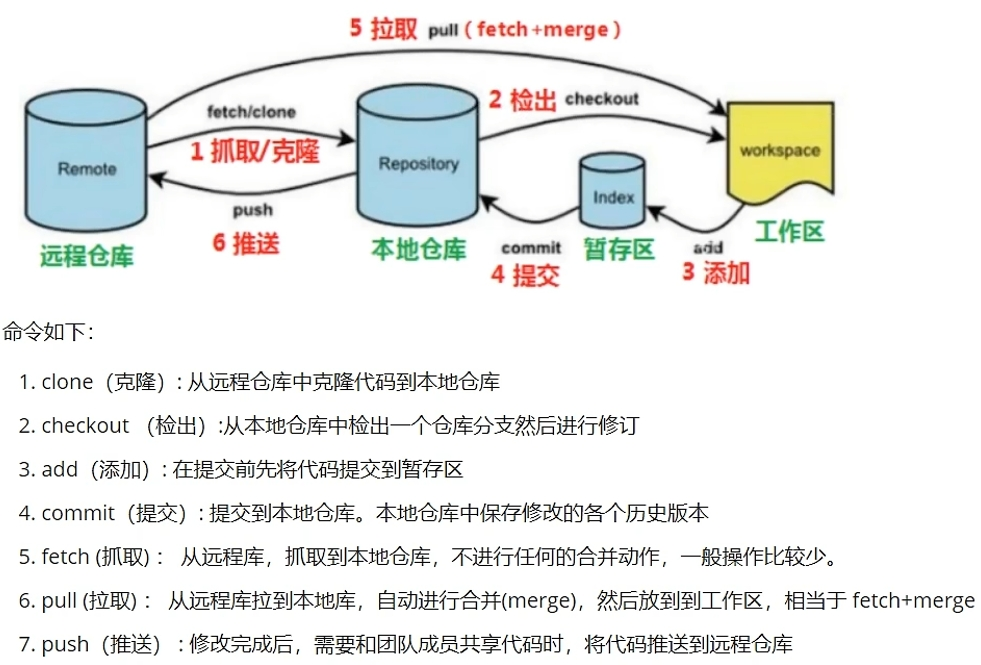

## Git commands for source code version control



### Feature
- [Git Reference doc](https://git-scm.com/docs)
- [Git Book](https://git-scm.com/book/en/v2)
- [Git Commit Message 规范](https://konglingfei.com/onex/convention/commit.html)
- 利用工具进行 Commit Message 规范自动化, 不满足规则的 commit 不允许提交
- Angular 规范中, Commit Message 包含 Header、Body 和 Footer, 格式如下:
```shell
<type>[optional scope]: <description>
// 空行
[optional body]
// 空行
[optional footer(s)]

```
- Header一行,三个字段: type(必选), scope(可选)和 subject(必选)
- example: **git commit -m "feat(camera_module): add CIS camera driver and interface"**

| 类型       | 类别          | 说明 |
|  ----     | ----          |----  |
| feat	    | Production	| 新增功能 |
| fix	    | Production	| Bug 修复 |
| perf	    | Production	| 提高代码性能的变更 |
| style	    | Development	| 代码格式类的变更，比如用 clang-format 格式化代码、删除空行等 |
| refactor	| Production	| 其他代码类的变更，这些变更不属于 feat、fix、perf 和 style，例如简化代码、重命名变量、删除冗余代码等 |
| test	    | Development	| 新增测试用例或是更新现有测试用例 |
| ci	    | Development	| 持续集成和部署相关的改动，比如修改 Jenkins、GitLab CI 等 CI 配置文件或者更新 systemd unit 文件 |
| docs	    | Development	| 文档类的更新，包括修改用户文档或者开发文档等 |
| chore	    | Development	| 其他类型，比如构建流程、依赖管理或者辅助工具的变动等 |

**@note**: Development 这类修改一般是项目管理类的变更,不会影响最终用户和生产环境的代码, 如 CI 流程、构建方式等的修改; 遇到这类修改,通常也意味着可以免测发布. Production 这类修改会影响最终的用户和生产环境的代码, 所以对于这种改动, 一定要慎重, 并在提交前做好充分的测试.

### Commands Tricks

```shell
# ---------------------------------------------------------
# 全局配置 git 基本信息(--system, --global, --local)
git config --global user.name "Wei Li"
git config --global user.email "weili_yzzcq@163.com"
git config --global core.editor "code --wait"
# 以默认的编辑器, 查看全局配置文件
git config --global -e
# Windows "\r\n(CRLF)" ---> true
# Linux and Mac "\n(LR)" ---> input
git config --global core.autocrlf true # Windows
git config --global core.autocrlf input # Mac or Linux

# 查看 git 配置信息
git config --global --list
git config --list

# ---------------------------------------------------------
# 增删查改基本操作
# how to read the help information of Command line
git --help

# basic command
git add .
git status
git add filename.cpp
git commit -m "feat(camera_module): add CIS camera driver and interface"

git clone
git pull
git push
git merge
git checkout
git branch

# ---------------------------------------------------------
# 合并提交 merge commits when MR or PR into main branch
# 将多个 commit 合并为一个 commit 提交,
# 建议把新的 commit 合并到主干时, 只保留 2~3 个 commit 记录
git log --oneline
git rebase -i HEAD~3

# ---------------------------------------------------------
# 查看 git 项目关联的远程仓库信息
git remote --verbose
git remote -v
git remote --help
# 添加/移除远程仓库并指定名称为 'mirror', 可以关联多个远程仓库
git remote add mirror https://github.com/project/project.git
git remote remove mirror

# ---------------------------------------------------------
# 冲突解决 conflict
# git mergetool --tool-help
git config --global merge.tool vscode
git config --global mergetool.vscode.cmd "code --wait $MERGED"
# '$' 变量符号好像无法解析, 需要检查一下配置文件, 添加完整内容
git config --global -e

# ---------------------------------------------------------
# 对比工作区和暂缓区的文件差异
git diff
# 对比暂缓区的版本文件间差异
git diff --staged
# 利用一些可视化工具进行对比查看, 如 VSCode
# git difftool --tool-help
git config --global diff.tool vscode
git config --global difftool.vscode.cmd "code --wait --diff $LOCAL $REMOTE"
git config --global -e
git difftool
git difftool --staged

# ---------------------------------------------------------
# git 仓库项目中依然引用其他 git 仓库时候, 需要递归克隆
git clone --recursive https://github.com/NVlabs/instant-ngp.git
cd instant-ngp
git clone --recursive https://github.com/NVlabs/instant-ngp.git -b master NGP
cd NGP

```
