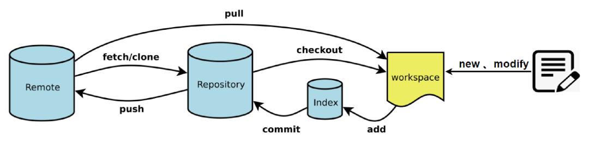
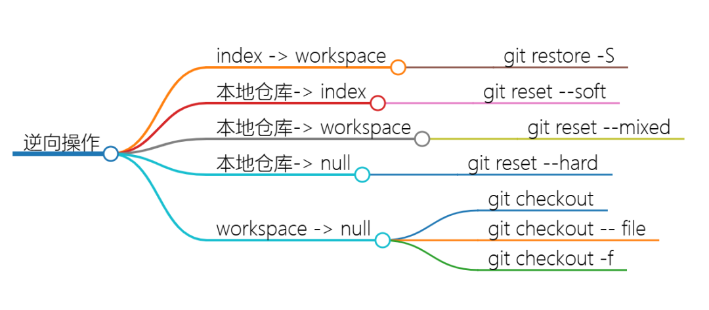

## Git commands for source code version control


### Feature
- [Git Reference doc](https://git-scm.com/docs)
- [Git Book](https://git-scm.com/book/en/v2)
- [Git Commit Message 规范](https://konglingfei.com/onex/convention/commit.html)
- 利用工具进行 Commit Message 规范自动化, 不满足规则的 commit 不允许提交
- Angular 规范中, Commit Message 包含 Header、Body 和 Footer, 格式如下:
```shell
<type>[optional scope]: <description>
// 空行
[optional body]
// 空行
[optional footer(s)]

```
- Header一行,三个字段: type(必选), scope(可选)和 subject(必选)
- example: **git commit -m "feat(camera_module): add CIS camera driver and interface"**

| 类型       | 类别          | 说明 |
|  ----     | ----          |----  |
| feat	    | Production	| 新增功能 |
| fix	    | Production	| Bug 修复 |
| perf	    | Production	| 提高代码性能的变更 |
| style	    | Development	| 代码格式类的变更，比如用 clang-format 格式化代码、删除空行等 |
| refactor	| Production	| 其他代码类的变更，这些变更不属于 feat、fix、perf 和 style，例如简化代码、重命名变量、删除冗余代码等 |
| test	    | Development	| 新增测试用例或是更新现有测试用例 |
| ci	    | Development	| 持续集成和部署相关的改动，比如修改 Jenkins、GitLab CI 等 CI 配置文件或者更新 systemd unit 文件 |
| docs	    | Development	| 文档类的更新，包括修改用户文档或者开发文档等 |
| chore	    | Development	| 其他类型，比如构建流程、依赖管理或者辅助工具的变动等 |

**@note**: Development 这类修改一般是项目管理类的变更,不会影响最终用户和生产环境的代码, 如 CI 流程、构建方式等的修改; 遇到这类修改,通常也意味着可以免测发布. Production 这类修改会影响最终的用户和生产环境的代码, 所以对于这种改动, 一定要慎重, 并在提交前做好充分的测试.

### Commands Tricks

```shell
# ---------------------------------------------------------
# 全局配置 git 基本信息(--system, --global, --local)
git config --global user.name "Wei Li"
git config --global user.email "weili_yzzcq@163.com"
git config --global core.editor "code --wait"
# 以默认的编辑器, 查看全局配置文件
git config --global -e
# Windows "\r\n(CRLF)" ---> true
# Linux and Mac "\n(LR)" ---> input
git config --global core.autocrlf true # Windows
git config --global core.autocrlf input # Mac or Linux

# 查看 git 配置信息
git config --global --list
git config --list

# ---------------------------------------------------------
# 增删查改基本操作
# how to read the help information of Command line
git --help

# basic command
git add .
git status
git add filename.cpp
git commit -m "feat(camera_module): add CIS camera driver and interface"

git clone
git pull
git push
git merge
git checkout
git branch

# ---------------------------------------------------------
# 合并提交 merge commits when MR or PR into main branch
# 将多个 commit 合并为一个 commit 提交,
# 建议把新的 commit 合并到主干时, 只保留 2~3 个 commit 记录
git log --oneline
git rebase -i HEAD~3

# ---------------------------------------------------------
# 查看 git 项目关联的远程仓库信息
git remote --verbose
git remote -v
git remote --help
# 添加/移除远程仓库并指定名称为 'mirror', 可以关联多个远程仓库
git remote add mirror https://github.com/project/project.git
git remote remove mirror

# ---------------------------------------------------------
# 冲突解决 conflict
# git mergetool --tool-help
git config --global merge.tool vscode
git config --global mergetool.vscode.cmd "code --wait $MERGED"
# '$' 变量符号好像无法解析, 需要检查一下配置文件, 添加完整内容
git config --global -e

# ---------------------------------------------------------
# 对比工作区和暂缓区的文件差异
git diff
# 对比暂缓区的版本文件间差异
git diff --staged
# 利用一些可视化工具进行对比查看, 如 VSCode
# git difftool --tool-help
git config --global diff.tool vscode
git config --global difftool.vscode.cmd "code --wait --diff $LOCAL $REMOTE"
git config --global -e
git difftool
git difftool --staged

# ---------------------------------------------------------
# git 仓库项目中依然引用其他 git 仓库时候, 需要递归克隆
git clone --recursive https://github.com/NVlabs/instant-ngp.git
cd instant-ngp
git clone --recursive https://github.com/NVlabs/instant-ngp.git -b master NGP
cd NGP


```

### Modern Git Commands
- git switch: 安全切换分支, since Git 2.23.0
- 通过将 git checkout 的功能拆分, Git 团队创建了两个新的、更专业的命令:
    - git switch: 专门用于在分支之间进行切换
    - git restore: 专门用于还原文件内容

```shell
# 切换到已存在的分支
$ git switch <branch-name>

# 创建并切换到新分支
$ git switch -c <new-branch-name>

# 从远程仓库创建并跟踪一个本地分支
$ git switch -c <new-branch-name> --track <remote>/<branch-name>

# 返回到上一个分支
$ git switch -
```

- git restore: 安全撤销更改 since Git 2.23.0 
- git restore 主要用来撤销工作目录中的更改,
    - 可以用来丢弃未提交的工作树修改、还原删除的文件, 或者将文件重置为之前的某个提交状态
    - 使用 git restore 时，可以选择性地指定 --staged 来影响暂存区
    - 或者 --worktree 来影响工作目录
    - 如果同时指定了这两个选项, 则会同时影响暂存区和工作目录
- git restore 是一个相对安全的操作, 因为它不会改变分支的历史记录, 它只会影响工作目录和/或暂存区

```shell
# 恢复工作目录中的文件到最近一次提交的状态
$ git restore <file>

# 从指定的提交中恢复文件到工作目录
$ git restore --source=<commit> <file>

# 取消暂存区的更改（类似于 git reset HEAD <file>）
$ git restore --staged <file>

# 恢复所有文件到指定的提交状态
$ git restore --source=<commit> .

# 恢复所有已删除的文件
$ git restore -w -- *

# 丢弃暂存区和工作目录中的更改（即恢复到指定的提交状态）
$ git restore --staged --worktree <file>
```

- git worktree: 同时在多个分支工作
- git sparse-checkout: 高效处理大型仓库 since Git 2.25.0
    - 如果只想检出 src 目录及其子目录中的文件, 可以这样做
    - $ git sparse-checkout set src/
- git range-diff: 比较提交范围之间的更改 since Git 2.19.0
- git maintenance: 自动化仓库健康 since Git 2.30.0
- git log --remerge-diff: 更好地理解合并 since Git 2.35


### Git forward and backward




```shell
# -------- 暂存区 <---> 工作空间 --------
$ git add test.cpp
# 1. 数据已经由工作空间（workspace）提交（add）到暂存区（Index）
# 可以使用git restore -S 命令，它主要用于将某个文件的状态恢复为指定的状态
git restore -S test.cpp
$ git rm --cached test.cpp

# -------- 本地仓库 <---> 暂存区、工作区及清空 --------
$ git commit test.cpp
# 2. 数据已经由暂存区（Index）提交（commit）到本地仓库（Repository）
git reset --soft/head/mixed

# --------------------------------------------------------
# 在未进行git push前的所有操作，将"本地仓库"的代码还原操作叫做"撤销"

# case 1: 文件被修改了, 但未执行git add操作(working tree内撤销)
$ git checkout fileName
$ git checkout .

# case 2: 同时对多个文件执行了git add操作, 但本次只想提交其中一部分文件
# git add * or git add .
$ git status
# 取消暂存
$ git reset HEAD <filename>
$ git restore --staged <filename>

# case 3: 文件执行了git add操作, 但想撤销对其的修改(index内回滚)
# git add index.cpp
# 取消暂存, Git跟踪状态改变
$ git restore --staged <filename>
$ git reset HEAD fileName
# 撤销修改, 内容被撤销
$ git checkout fileName

# case 4: 修改的文件已被git commit, 但想再次修改不再产生新的Commit
# 修改最后一次提交 
$ git add sample.txt
$ git commit --amend -m"说明"

# case 5: 已在本地进行了多次git commit操作, 现在想撤销到其中某次Commit
git reset [--hard|soft|mixed|merge|keep] [commit|HEAD]

# --------------------------------------------------------
# 已进行git push, 将已被提交到"远程仓库"的代码还原操作叫做"回滚"
# @note: 对远程仓库做回滚操作是有风险的, 需提前做好备份和通知其他团队成员

# case 1: 如果每次更新线上, 都会打tag, 那恭喜可以很快的处理
$ git checkout <tag> 

# case 2: 撤销指定文件到指定版本
# 查看指定文件的历史版本
$ git log --oneline <filename>
# 回滚到指定 commitID
$ git checkout <commitID> <filename>

# case 3: 删除最后一次远程提交
# 使用 revert or 使用reset
$ git revert HEAD
$ git push origin master/main

# revert 是放弃指定提交的修改,但是会生成一次新的提交,需要填写提交注释,以前的历史记录都在;
# reset 是指将HEAD指针指到指定提交, 历史记录中不会出现放弃的提交记录;

# 使用 revert or 使用reset
$ git reset --hard HEAD^
$ git push origin master/main -f

# case 4: 回滚某次提交
# 找到要回滚的commitID
$ git log --oneline
$ git revert commitID

# case 5: 删除某次提交(合并多次提交commit记录)
$ git log --oneline -n5
$ git rebase -i "commit-id"^
# 注意: 最后的 ^ 号, 意思是commit id的前一次提交;
# 在编辑框中删除相关commit, 如pick 5b3ba7a test2, 然后保存退出(如果遇到冲突需要先解决冲突);
$ git push origin master/main -f

```
