# Linux Foundation

**《鸟哥的 Linux 私房菜：基础学习篇》**

## Lecture 1: 计算机概论

- **接受使用者输入指令和数据，经由CPU的数学和逻辑单元处理后，以产生或存储有用的信息**
- **Central Processing Unit (CPU): 算数逻辑单元 (负责程序运算和逻辑判断) 和控制单元 (协调各周边元件和各单元间的工作)**
- **计算机硬件：输入设备；输出设备；CPU控制部分；CPU算数逻辑处理部分；内存等存储部分**
- **CPU架构：CPU微指令集的两种设计理念 (RISC and CISC)**
- **Reduced Instruction Set Computer, RISC 精简指令集，ARM CPU系列；Oracle SPARC系列；IBM Power Architecture系列**
- **Complex Instruction Set Computer, CISC 复杂指令集，AMD、Intel、VIA等 x86/x64结构的CPU**
- **设备元件: 主板 (沟通所有设备的芯片组，该芯片组连接所有设备单元)**
- **计算单位：容量单位 (bit，Byte，KB，MB，GB，TB，PB)；速度单位 (MHz/GHz，Mbps)**
- **CPU工作频率：外频和倍频，超频技术，超线程技术(Hyper-Threading，HT)**
- **Main memory; Dynamic Random Access Memory(DRAM); 双通道设计；L2 cache**
- **Basic Input Output System (BIOS); Read Only Memory (ROM); Firmware(固件, 就是绑定在硬件上控制软件)**
- **显卡(Video Graphics Array, VGA); 显存容量与屏幕分辨率与色彩深度；显卡嵌入能够运算的3D加速芯片(GPU)**
- **GPU和主板的 PCIe 连接接口; GPU和显示器的连接接口(HDMI, DVI)**
- **扇区(sector), 磁道(track), 柱面(cylinder); 磁盘数据读写操作**
- **扇区容量大小4KB; 磁盘分区模式: MSDOS; GPT; 磁盘的传输接口; Hard Disk Drive(HDD), Solid State Drive(SSD); RAID机制防止SSD读写次数限制; 缓冲内存**
- **CMOS主要记录主板的重要参数; BIOS是写入主板上Flash或EEPROM的程序;**
- **数据表示方式; 数值和文字的编码系统;(二进制, ASCII, Unicode)**
- **系统软件和应用软件; 操作系统(OS); 编译器; Operating System Kernel; System Call**
- **Kernel: System call interface; Process control; Memory management; Filesystem management; Device drivers**
- **CPU-Z on Windows (https://www.cpuid.com/softwares/cpu-z.html); lspci on Linux**

## Lecture 2: Linux

- **Linux Kernel; Linus Torvalds, 1991年**
- **History of Unix, Emacs, GCC, glibc, Bash shell, GNU (GNU's Not Unix), OpenSource, FreeSoftware, Shareware, X Window (GUI)**
- **GNU General Public License, GPL协议**
- **开放源代码授权协议: Apache License 2.0; BSD 3/2; GPL2/3; MIT License;**
- **Assembly Language; C Language**
- **Portable Operating System Interface, POSIX规范**
- **http://www.kernel.org/**
- **Linux version 1.0(1994); version 2.0(1996); version 3.0(2011); version 4.0(2015); version 5.0(2019)**
- **Linux Kernel Version Code: 主版本.次版本.释出版本-修改版本(5.11.0-42-generic); uname -r Command**
- **Linux Kernel Version 2 之前，采用奇偶版本**
- **Linux Kernel Version 3 之后，采用主线版本(MainLine)和长期维护版本(Longterm version)**
- **Linux Distributions Version = Linux Kernel + Softwares + Tools + 可完整安装程序; 可完整安装套件; Linux发布商套件**
- **Linux Distributions 主要异同在于支持的标准; Linux Standard Base(LSB); Filesystem HIerarchy Standard(FHS); 管理工具以及套件管理的模式有差异(RPM(CentOS) or dpkg(Ubuntu))**
- **https://www.pathname.com/fhs/**
- **https://wiki.linuxfoundation.org/lsb/start**
- **https://distrowatch.com/**
- **X Window system; KDE; GNOME; MS Office(OpenOffice/LibreOffice)**
- **Tarball Source Code(tar压缩包格式的源代码)**
- **Linux: 计算机概论和硬件; Linux Install and Command; Linux OS Foundation; Vi/Vim; Shell and Shell Script; 软件管理员; 网络基础**

## Lecture 3: 主机规划和磁盘分区

- **Linux与硬件的搭配; 硬件的适配**
- **CPU; RAM; Hard Disk; GPU; Network Interface Card**
- **Linux 一切皆文件; 硬件设备文件在 /dev/**
- **STAT接口的硬盘的文件名: /dev/sd[a-d]**
- **STAT接口的硬盘的文件名: /dev/sd[a-d]**
- **https://www.kernel.org/doc/Documentation/admin-guide/devices.txt**
- **CPU微指令集中整合硬件虚拟化指令集，支持虚拟化技术**
- **磁盘可以划分为分区(partition); SATA/USB/SAS磁盘接口都是使用SCSI模块来驱动的(/dev/ad[a-p])**
- **早期磁盘的第一个扇区(512Bytes)里面含有重要信息(Master Boot Record, MBR)**
- **磁盘容量扩大后，读写限制，新的磁盘分区格式 GPT(GUID partition table)**
- **磁盘分区表(partition table): MSDOS(MBR); GPT**
- **MSDOS(MBR): 磁盘的第一个扇区；主要开机记录区(Master Boot Record)安装开机管理程序(446Bytes); 分区表(partition table)记录硬盘分区状态(64Bytes); dev/sda1; /dev/sda2; dev/sda3; /dev/sda4(该四个分区称之为 Primary or Extended partition)**
- **扩展分区就是使用额外的扇区来记录分区信息，这样又 Extended partition 分区出来的分区称之为逻辑分区(logical partition)**
- **设备文件名 /dev/sda[1-4] 是保留给 Primary or Extended Partition，逻辑分区从 /dev/sda[5-], 这就是MBR格式分区表的特性**
- **MBR 主要分区、 延伸分区与逻辑分区的特性:**
    1. 主要分区与延伸分区最多可以有四个（硬盘的限制, 每组分区表大小 16Bytes * 4 = 64Bytes）
    2. 延伸分区最多只能有一个（ 操作系统的限制）
    3. 逻辑分区是由延伸分区持续切割出来的分区
    4. 能够被格式化后， 作为数据存取的分区为主要分区与逻辑分区。 延伸分区无法格式化
    5. 逻辑分区的数量依操作系统而不同， 在Linux系统中SATA硬盘已经可以突破63个以上的分区限制
    6. 分区是个很麻烦的东西， 因为是以柱面为单位的“连续”磁盘空间， 且延伸分区又是个类似独立的磁盘空间, 分区的时候得要特别注意**
- **GUID Partition Table, GPT; 扇区大小从 512Bytes 变成 4KBytes; 兼容性使用逻辑区块位址(Logical Block Address, LBA)解决**
- **GPT将磁盘所有区块以 LBA(默认512Bytes); LBA0为第一个LBA**

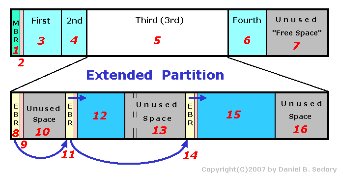
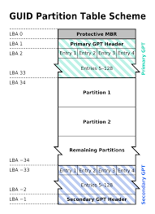

- **LBA0 (MBR 相容区块)**
    - 与 MBR 模式相似的， 这个相容区块也分为两个部份， 一个就是跟之前 446 Bytes 相似的区块，储存了第一阶段的开机管理程序！ 而在原本的区表的纪录区内， 这个相容模式仅放入一个特殊标志的分区， 用来表示此磁盘为 GPT 格式之意。 而不懂 GPT 分区表的磁盘管理程序， 就不会认识这颗磁盘， 除非用户有特别要求要处理这颗磁盘， 否则该管理软件不能修改此分区信息， 进一步保护了此磁盘喔！
- **LBA1 (GPT 表头纪录)**
    - 这个部份纪录了分区表本身的位置与大小， 同时纪录了备份用的 GPT 分区 （就是前面谈到的在最后 34 个 LBA 区块） 放置的位置， 同时放置了分区表的检验机制码（CRC32），操作系统可以根据这个检验码来判断 GPT 是否正确。若有错误，还可以通过这个纪录区来取得备份的 GPT（磁盘最后的那个备份区块）来恢复 GPT 的正常运行！
- **LBA2-33 (实际纪录分区信息处)**
    - 从 LBA2 区块开始， 每个 LBA 都可以纪录 4 笔分区纪录， 所以在默认的情况下， 总共可以有 128 笔分区纪录喔！ 因为每个 LBA 有 512Bytes， 因此每笔纪录用到 128 Bytes 的空间， 除了每笔纪录所需要的识别码与相关的纪录之外， GPT 在每笔纪录中分别提供了 64bits 来记载开始/结束的扇区号码， 因此， GPT 分区表对於单一分区来说，最大容量限制就会在“ 264 512Bytes = 263 1KBytes = 233TB = 8 ZB ”，GPT 分区已经没有所谓的主、 延伸、 逻辑分区的概念， 既然每笔纪录都可以独立存在， 当然每个都可以视为是主分区！ 每一个分区都可以拿来格式化使用！
- **开机检测程序: BIOS and UEFI; 并不是所有OS都可以读到GPT的磁盘分区; 并不是所有的硬件都支持GPT格式**
- **BIOS 搭配 MBR/GPT 开机流程**
- **CMOS 是记录各项硬件参数且嵌入在主板上的存储器; BIOS则是写入到主板上的固件(firmware)**
    1. BIOS 在开机后主动执行启动的第一个程序
    2. BIOS 分析计算机的存储设备，读取用户设置的启动硬盘的第一个扇区MBR位置
    3. MBR 里面的最基本的开机管理程序启动 (OS provided)
    4. 开机管理程序载入 (boot loader) 核心文件，启动操作系统
- **boot loader 主要任务**
    1. 提供菜单：用户选择不同的开机项目
    2. 载入核心文件：直接指向开机的程序区段启动操作系统
    3. 转交其他loader：将开机管理功能转交给其他loader负责 (双系统，开机扇区 boot sector)
    4. 开机管理程序可以按照在 MBR 以及 Boot Sector
- **UEFI BIOS 搭配 GPT 开机流程; Unified Extensible Firmware Interface(UEFI)**
- **UEFI 加入安全启动(secure boot)**

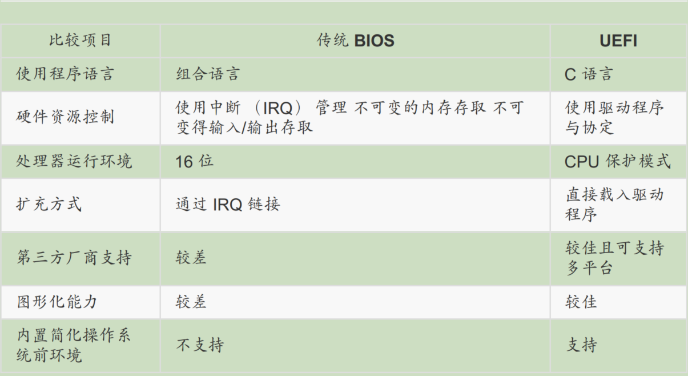
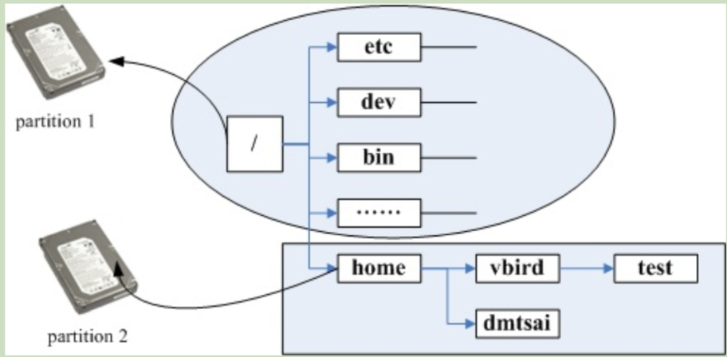

- **目录树架构(directory tree); 根目录(root directory)**
- **目录树架构和磁盘内数据的关联; 文件系统与目录树的关系: 挂载(mount)**
- **Linux OS使用的是目录树系统, 安装时候需要规划磁盘分区和目录树挂载**
    1. Linux 只要分区 "/" and "swap"
    2. 建议分区方法: 预留一个备用的剩余磁盘容量
    3. 选在 Linux 安装程序提供的默认硬盘分区方式
- **Linux Distribution; image file(镜像文件)**
- **主机服务: NAT服务; SAMBA服务; Mail服务; Web服务; DHCP服务; FTP服务**
- **主机硬盘规划; 数据安全和备份**
- **最简单分区方法: / & swap**
- **分析主机用途: 大容量目录和读写频繁的目录; /boot + / + /home + /var + Swap**

## Lecture 4: 安装 CentOS 7.x

- **主机规划，尤其是分区参数; Linux Distribution**
- **调整开机媒体 (BIOS); 虚拟机安装以及配置**
- **LVM: 是一种可以弹性增加/削减文件系统容量的设备设置**
- **格式化: 格式化什么文件系统(ext2/ext3/ext4; swap; Boot; xfs; vfat)**
- **Root passward; New User and passward**
- **内存压力测试; "烧机"**
- **笔记本安装时候考虑的核心参数; 电源管理模块**
- **救援 MBR 内的开机管理程序; 设置多重开机菜单**

## Lecture 5: 首次登录和线上求助

- **登录 GNOME; 重新启动 X 窗口管理员; 关机和开机**
- **[Alt]+[Ctrl]+[Backspace]**
- **X Window 与文字模式的切换(terminal/console); [Ctrl]+[Alt]+[F1]~[F6] 对应着 tty1~tty6**
- **终端提示符; # root 用户提示; $ 普通用户提示; 退出终端 exit command or [Ctrl] + [D]**
- **终端 shell 交互模式; bash shell; zsh**
- **command [-options] parameter1 parameter2 ...; 指令 选项 参数1 参数2**
- **-h; --help; -V; --version; 反斜线 \ 跳脱 [Enter]符号，指令连续到下一行**
- **command 大小写敏感**
- **locale command 显示目前所支持的语系; date command 显示当前时间**
- **基础指令的操作**

```bash
# 1. 显示日期和时间 man date
date
# 2. 显示日历 man cal
cal
# 3. 简单好用的计算器 man bc
bc
```

- **重要的热键: [Tab]; [Ctrl]+c; [Ctrl]+d (End of File, EOF or End Of Input)**
    1. [Tab] 接在一串指令的第一个字的后面， 则为“命令补全”
    2. [Tab] 接在一串指令的第二个字以后时， 则为“文件补齐”
    3. 安装 bash-completion 软件，则在某些指令后面使用 [tab] 按键时，可以进行“选项/参数的补齐”功能
- **错误信息的查看与可能的解决方案**
- **command --help; 理解回显的信息所表达的意思; 基本用法; 选项说明**
- **man command; man page sections; 基本用法; 选项说明**
- **man page; 空白键向下翻页; q 退出 man page; "/" 按下 / 后进行 words 的向下搜索; ？string 向上搜索该字符串**

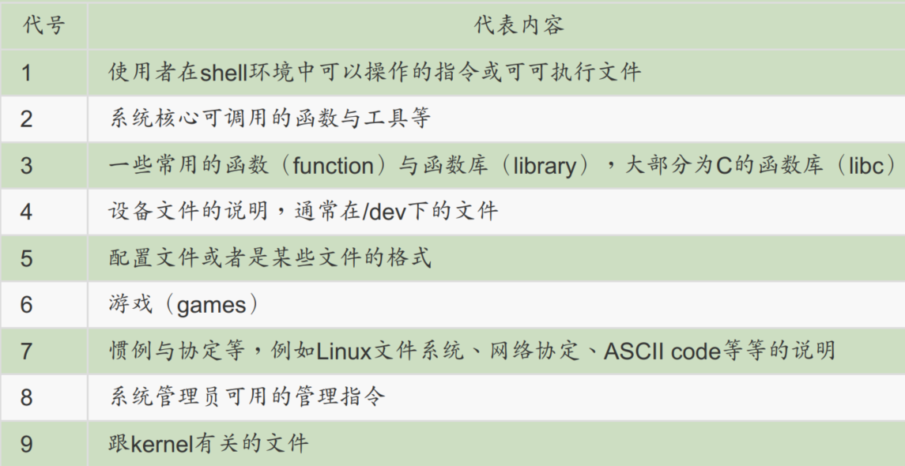
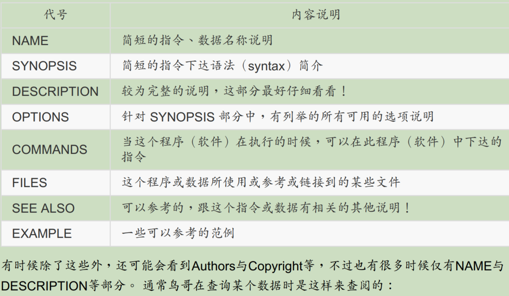
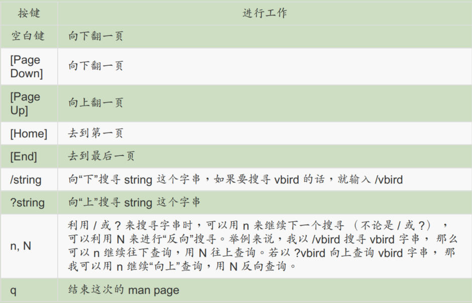

- **搜寻特定指令/文件的 man page 说明文档**

```bash
# /usr/share/man/ 目录
# -f 指定文件
man -f man
# -k 指定关键字
man -k man

# /usr/share/info/ 目录
info info
info man
```

- **info page; 额外提供的线上求助方式, 用于查询指令的用法或者文件的格式**
- **useful documents in /usr/share/doc/ and How-To**
- **简单文本编辑器 nano; 基本使用方法，进入，退出，搜索字符串**
- **正确关机: who; netstat -a; ps -aux; shutdown and reboot; 权限**
- **将数据同步写入硬盘中的指令: sync**
- **惯用的关机指令: shutdown; man shutdown**
- **重新开机, 关机: reboot; halt; poweroff**
- **这些指令都会完成同样的工作，全部的动作都是在调用 systemctl 这一个管理命令**

## Lecture 6: Linux 文件权限和目录配置

- **使用者(owner); 群组(group); 非本群组外的其他人(others)**
- **Linux 使用者身份与群组记录的文件: /etc/passwd; /etc/shadow; /etc/group**
- **读权限(read); 写权限(write); 执行权限(execute)**
- **文件以及文件属性: -rw-rw-r--  1 weili weili    0 10月 28 19:07 Colors**
- **[文件类型][owner permission][group permission][others permission][number of hard link][owner][group][size of file][date][file name]**
- **文件类型: 目录(d); 普通文件(-); 链接文件(l); 块设备文件(b); 字符设备文件(c); 管道文件(p); 套接字文件(s); 其他文件**
- **文件种类: directory(d); regular file[ASCII\binary\data](-); link(l); block(b); character(c); pipe/FIFO(p); sockets(s); 其他文件**
- **chgrp 修改文件所属群组**
- **chown 修改文件拥有者**
- **chmod 修改文件权限 (数字表示方法或者符号表示方法进行权限变更); r(4)w(2)x(1) or u+g+o+a**
- **目录和文件的权限所表示的意义不同**
- **文件是实际含有数据的，一般文本文件、数据库、二进制执行文件**
    1. r(read): 可以读取该文件的实际内容，如读取文本文件的文字字符
    2. w(write): 可以编辑、新增或者修改该文件内容，但不含删除该文件
    3. x(execute): 该文件具有被系统执行的权限，如 shell 脚本文件
- **目录权限很重要; 目录主要的内容是记录文件名清单以及对应的存储在磁盘上的关联信息**
    1. r(read contents in directory): 具有读取该目录结构清单的权限，查询该目录下的文件名数据
    2. w(modify contents of directory): 具有异动该目录结构清单的权限 (创建新的文件和目录;删除/重命名已经存在的文件与目录;搬移该目录内的文件或目录的位置)
    3. x(access directory): 表示使用者能否进入该目录成为工作目录(work directory), 即当前目录
- **Linux 文件扩展名并不能表明该文件的执行情况(执行权限); 仅仅提示用户表示该文件是什么类型的**
- **".sh" shell scripts file; ".tar/.tar.gz/.tgz" 打包压缩后的文件**
- **Linux 文件长度限制; Linux 文件名称限制; 按照 C 语言的变量声明要求**
- **Filesystem Hierarchy Standard (FHS); Dictionary Tree**
- **https://en.wikipedia.org/wiki/Filesystem_Hierarchy_Standard**
- **FHS 针对目录树架构仅定义出三层目录下面应该放置什么数据：**
    1. / (root, 根目录) 与开机系统有关
    2. /usr (unix software resource) 与软件安装/执行有关
    3. /var (variable) 与系统运行过程有关

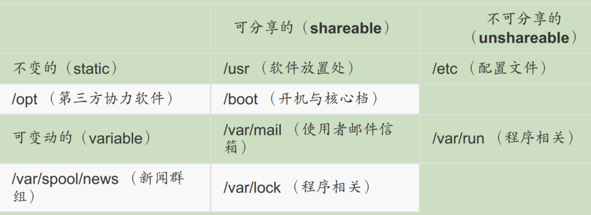
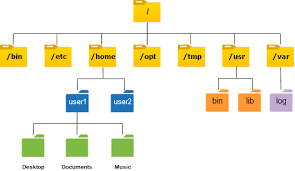

- **path: 绝对路径(absolute)和相对路径(relative)**
- **"." 表示当前路径; ".." 表示上一层目录; "~" 表示当前用户的家目录; "-" 表示刚刚上一次切换的路径**

```bash
# 查看核心版本 kernel version
uname -r

# 查看操作系统的位版本 x86 or x64
uname -m

# Linux Standard Base, LSB
# sudo apt update && apt install -y lsb-release && apt clean all
lsb_release -a
```

## Lecture 7: Linux 文件与目录管理

- **绝对路径(absolute)用途和相对路径(relative)用途**
- **cd; pwd; mkdir; rmdir; rm**
- **可执行文件路径的变量(环境变量): $PATH; echo $PATH**
- **$PATH: 大写格式; 每个目录分隔用(:); 目录有顺序(搜索)**
- **为了安全起见，不建议将 "." 加入 PATH 的搜索路径中**
- **ls; cp; rm; mv; basename(获取文件名); dirname(获取目录名)**
- **https://www.linuxcool.com/**
- **https://man.linuxde.net/**
- **文件内容查看: cat; tac; more; less; head; tail; od**
- **echo password | od -t oCc**
- **修改文件时间或创建新文件: torch; 文件的时间很重要**
    1. modification time (mtime): 当该文件的"内容数据"变更时候，更新该时间 mtime
    2. status time (stime): 当该文件的"状态"变更时候，如权限与属性更改，更新该时间 stime
    3. access time (atime): 当该文件的内容被取用(访问)时候，更新该时间 atime
- **文件默认权限: umask; umask -S; mask 计算的时候考虑掩码; umask与权限的计算方式; 二进制AND、NOT**
- **文件隐藏属性; 系统安全(Security); chattr (设置隐藏属性); lsattr (显示文件隐藏属性 lsattr -adR file_dir)**
- **文件特殊权限: SUID(Set UID, s 标志出现在 x 位置, 针对 binary program), SGID(Set GID), SBIT(Sticky Bit, t 标志, 针对目录)**
- **文件特殊权限数字表示: SUID(4), SGID(2), SBIT(1)**
- **ls -ld /tep; ls -l /usr/bin/passwd**
- **查看文件类型: file (ASCII/Data/Binary/share library); 可用于判断 tar packages, 该 tarball 文件是使用哪一种压缩算法**
- **指令与文件(配置文件)的检索**
- **which -a command**
- **type history**
- **whereis [-bmsu] filename or dir_name; whereis 只寻找系统中某些特定目录下的文件，比 find 快**
- **locate [-ir] keyword; locate 则是利用数据库来检索文件名，比 find 快; updatedb 命令更新数据库**
- **find [PATH] [option] [action]; 对磁盘进行检索，速度慢**
- **注意权限与指令之间的关系**

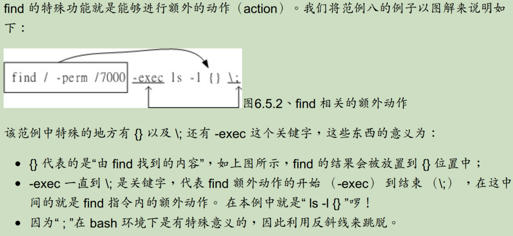

## Lecture 8: Linux 磁盘与文件系统管理

- **Linux 最传统的磁盘文件系统(filesystem) EXT2/3/4 (inode)**
- **磁盘分区(partition)后需要格式化(format)才能使用; 因为操作系统所设置的文件属性/权限并不相同, 为了存放这些文件所需的数据，分区格式化后便于OS利用"文件系统格式(filesystem)"**
- **一般一个 filesystem 就是一个 partition; LVM 与 software raid(软件磁盘阵列)技术，可将一个分区格式为多个文件系统，也能将多个分区合并为一个文件系统**
- **filesystem 将实际数据放在 data block 区块中，将文件权限和属性放在 inode 中, 还有一个 superblock 记录整个文件系统的整体信息，包括 inode 和 block 的总量/使用量/剩余量**
    1. superblock: 记录 filesystem 的整体信息， 包括 inode/block 的总量、使用量、剩余量，以及文件系统的格式与相关信息等
    2. inode: 记录文件的属性和权限，一个文件占用一个 inode，同时记录此文件的数据所在的 block 号码
    3. block: 实际记录文件的内容，若文件太大时，会占用多个 block
    4. 这种依据 inode 编号对 block 的数据进行存取方式称之为索引文件系统 (indexed allocation)
- **inode table**
    - 该文件存取模式 (read/write/execute)
    - 该文件的拥有者和群组 (owner/group)
    - 该文件的容量
    - 该文件创建或状态改变时间 (ctime)
    - 该文件最近一次的读取时间 (atime)
    - 该文件最近修改时间 (atime)
    - 定义文件特性的标志 (flag)
    - 该文件真正内容的指向 (pointer)
- **Filesystem Description(文件系统描述说明); block bitmap(区块对照表); inode bitmap(inode对照表)**
- **dumpe2fs: 查询 Ext 家族 superblock 信息的指令**
- **ls -li; -i 选项查看文件所占用的 inode 编号**
- **文件数据离散问题，导致读取效率下降**
- **metadata 的内容与实际数据存放会产生不一致(inconsistent)的情况; 日志式文件系统 (Journaling filesystem)**
- **Linux 文件系统的运行; 磁盘读写瓶颈; 非同步处理(asynchronously)方式**
- **系统载入文件到内存后，未更动则是clean; 若更动过则是Dirty; OS 不定时将内存中Dirty数据写回磁盘**
- **filesystem文件系统与目录树结合的动作，称之为挂载; mount point 的意义**
- **ls -ild / /. /..**
- **Linux 支持的文件系统**
    1. 传统文件系统: ext2/minix/MS-DOS/FAT/iso9660
    2. 日志式文件系统: ext3/ext4/ReiserFS/Windows'NTFS/IBM's JFS/SGI's XFS
    3. 网络文件系统: NFS/SMBFS

```bash
# 查看 Linux 所支持的文件系统
ls -l /lib/modules/$(uname -r)/kernel/fs

# 系统目前已载入到内存中支持的文件系统
cat /proc/filesystems
```

- **Linux VFS(Virtual Filesystem Switch)**
- **VFS 管理所有的文件系统 filesystem**
- **XFS filesystem 被开发用于大容量磁盘以及高性能文件系统**
    1. data section 数据区
    2. log section 文件系统活动登录区
    3. realtime section 实时运行区
- **xfs_info command 查看 XFS filesystem**
- **df: 列出文件系统的整体磁盘使用量**
- **du: 评估文件系统的磁盘使用量，常用于推估目录所占容量**
- **硬链接(hard link)和软链接(symbolic link) (实体链接和符号链接): ln**
    1. hard link 不能跨 filesystem
    2. hard link 不能链接目录
    3. hard link 通过 filesystem 的 inode 链接从而产生一个新文件名
    4. symbolic link 就是一个快捷键，其本质就是文件的路径从而创建一个独立的文件(占用新的 inode 和 block)
    5. ln [-sf] source_file object_file; -s 表示 symbolic link; -f 若object_file存在，则主动将其移除后创建
- **磁盘的分区(partition)、格式化(format)、检验和挂载(mount)**
- **查看磁盘的分区状态: parted; fdisk(MBR 分区表); gdisk(GPT 分区表)**
- **lsblk [-dfimpt] [device]; (list block device); 列出系统上所有磁盘列表**
- **blkid; (universally unique identifier); 列出设备的 UUID 等参数**
- **make filesystem, mkfs command 进行文件系统的格式化**
- **单一文件系统不应该被重复挂载在不同的挂载点中**
- **单一目录不应该重复挂载多个文件系统**
- **要作为挂载点的目录，理论上应该都是空目录**
- **mount command and umount command**
- **mknod command 磁盘/文件系统参数修订**
- **设置开机挂载; /etc/fstab; /etc/mtab**
- **特殊设备 loop 挂载 (镜像文件不烧录就挂载使用); 光盘镜像文件或者是使用文件作为磁盘的方式**
- **内存交换空间 (swap)**
- **swap 主要的功能是当实体内存不够时，则某些在内存当中所占的程序会暂时被移动到 swap 当中，让实体内存可以被需要的程序来使用**
- **如果主机支持电源管理模式，Linux 主机系统可以进入“休眠”模式的话，那么运行当中的程序状态则会被纪录到 swap 去，以作为“唤醒”主机的状态据，有某些程序在运行时，本来就会利用swap 的特性来存放一些数据段，swap 是需要创建的，只是不需要太大**

## Lecture 9: 文件与文件系统的压缩,打包与备份

- **Linux 文件的扩展名没有特殊意义**
- **Linux 压缩指令所做出来的压缩文件，便于记忆，特殊的命名方式和扩展名**
- **文件压缩技术; 降低磁盘使用量; 缓解网络传输带宽**
    1. 减少文件没有用到的空间
    2. 精简重复的数据镜像统计记录
- **Linux 常见压缩扩展名: ".tar"; ".tar.gz"; ".tgz"; ".gz"; ".Z"; ".bz2"; "*.xz"**
    - *.Z compress 程序压缩的文件
    - *.zip zip 程序压缩的文件
    - *.gz gzip 程序压缩的文件
    - *.bz2 bzip2 程序压缩的文件
    - *.xz xz 程序压缩的文件
    - *.tar tar 程序打包的数据， 并没有压缩过
    - *.tar.gz tar 程序打包的文件， 其中并且经过 gzip 的压缩
    - *.tar.bz2 tar 程序打包的文件， 其中并且经过 bzip2 的压缩
    - *.tar.xz tar 程序打包的文件， 其中并且经过 xz 的压缩
- **Linux 常见压缩指令: gzip; bzip2; xz; zip; compress; (针对单个文件才能进行压缩)**
- **Linux 打包软件: tar; (将多个文件 "打包" 成为一个文件)**
- **gzip 可以解压缩 compress, zip和gzip 压缩的文件; gzip 所创建的压缩文件后缀为 "*.gz"**
- **gzip 压缩默认原来的文件被压缩为 .gz 文件名，原始文件不存在了; gzip 压缩可以被 Windows 下 7zip/WinRAR 解压**
- **zcat/zmore/zless/egrep 针对压缩文件进行查看和查找关键字**
- **bzip2 则是为了取代 gzip 并提供更佳的压缩比; GUN(gzip/bzip2/xz) 后续又推出 xz 压缩指令**
- **bzcat/bzmore/bzless/bzgrep 针对压缩文件进行查看和查找关键字**
- **tar 打包指令配合压缩指令; tar [-zjJctvC]**
    - -c：创建打包文件，可搭配 -v 来察看过程中被打包的文件名(filename)
    - -t：查看打包文件的内容含有哪些文件名，重点在察看“文件名”就是了
    - -x：解打包或解压缩的功能，可以搭配 -C (大写)在特定目录解开
    - 特别留意的是，-c, -t, -x 不可同时出现在一串命令行中
    - -z：通过 gzip 的支持进行压缩/解压缩, 此时文件名最好为 *.tar.gz
    - -j：通过 bzip2 的支持进行压缩/解压缩, 此时文件名最好为 *.tar.bz2
    - -J：通过 xz 的支持进行压缩/解压缩, 此时文件名最好为 *.tar.xz
    - 特别留意， -z, -j, -J 不可以同时出现在一串命令行中
    - -v：在压缩/解压缩的过程中，将正在处理的文件名显示出来
    - -f filename：-f 后面要立刻接要被处理的文件名！建议 -f 单独写一个选项啰！(比较不会忘记）
    - -C 目录：这个选项用在解压缩，若要在特定目录解压缩，可以使用这个选项
    - -p (小写)：保留备份数据的原本权限与属性，常用于备份(-c)重要的配置文件
    - -P (大写)：保留绝对路径，亦即允许备份数据中含有根目录存在之意
    - --exclude=FILE：在压缩的过程中，不要将 FILE 打包
- **tar 打包后没有进行压缩所得到的文件称之为 tarfile**
- **tar 打包后再进行压缩所得到的文件称之为 tarball**
- **tar 利用 pipe 管道命令和 standard input/output 数据流重导向**
- **xfsdump/sfxrestore 指令对 XFS 文件系统的备份和还原**
- **将所需要备份数据创建一个镜像文件(iso), 利用 mkisofs 指令; 将该镜像文件烧录到光盘/DVD中, 利用 cdrecord 指令**
- **dd 指令进行备份; 直接读取磁盘上 sector 扇区数据**
- **cpio 指令可以备份任何东西, 包括设备文件**

## Lecture 10: Vim 程序编辑器

- **利用 Vi/Vim 文本编辑器修改配置文件**
- **Linux 命令行下文本编辑器: emacs; pico; nano; joe; vi/vim**
- **https://www.vim.org/**
- **Vi 三种模式: 指令模式(command mode); 编辑模式(insert mode); 命令行命令模式(command-line mode)**
    - command mode: 移动光标; 增删改查字符
    - insert mode: 编辑文本
    - command-line mode: 搜索数据; 读取/存盘/取代字符/离开Vi/显示行号等操作
    - [Esc] 切换 command mode 和 insert mode
- **Vim 暂缓盘、救援回复与打开时的警告讯息**
- **本文编辑器的 "回复" 功能; .filename.swp**
- **Vi 以列为单位进行操作; Vim 的 Visual Block 区块选择(Vim 的可视模式)**
- **多文件编辑; 多窗口功能; 挑字补全功能**
- **https://notepad-plus-plus.org/**
- **Vim 环境配置与记录: ~/.vimrc; ~/.viminfo**
- **Vim 常用指令示意图**

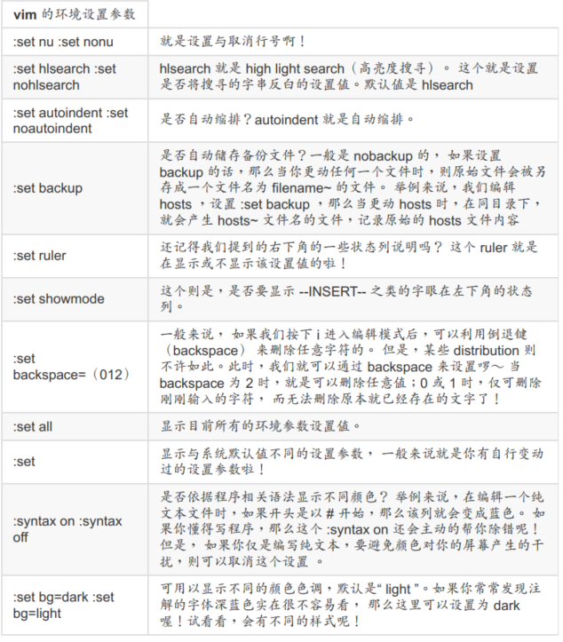
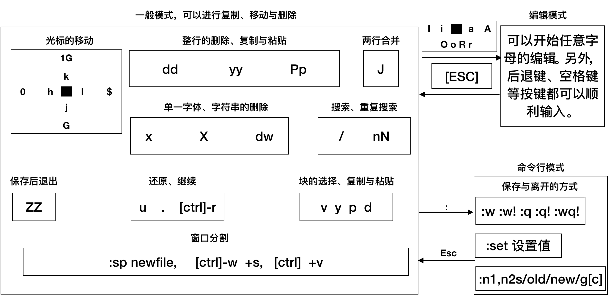

- **Vim 中文编码问题; Linux 系统默认支持的语系; bash 语系; 文本原本的编码; GNOME 窗口接口编码**
- **Windows-DOS(^M$, 称为 CR与LF 两个符号) 和 Linux(只有 LF[$]) 断行字符不同**
- **unix2doc/doc2unix 指令解决 Windows/Linux 断行字符不同的问题**
- **iconv 指令进行语系编码转换**

## Lecture 11: Bash 的认识与学习

- **hardware --> kernel(OS) --> shell --> application**


- **shell; /ect/shells**
    - Bourne Shell(sh)
    - Bourne Again Shell(bash in Linux)
    - C Shell(Sun)
    - K Shell
    - Zsh
- **Bash shell**
    - history 命令编修能力
    - [Tab] 命令与文件补全功能; bash-completion
    - alias 命令别名设置功能; alias lm='ls -al'
    - job control/foreground/background 工作控制/前景(前台)/背景(后台)控制
    - shell scripts 程序化脚本
    - Wildcard 万用字符(通配符)
- **查询指令是否 Bash shell 内置命令: type**
- **[Ctrl] + u/k: 分别从光标处向前/向后删除指令串**
- **[Ctrl] + a/e: 分别让光标移动到最前面/最后面**
- **环境变量; 变量的取用与设置**
    - 变量的可变性和便捷性
    - 影响 Bash 环境操作的变量
    - 脚本程序设计 shell script
    - echo ${Variable}
    - unset variable
    - export 将变量变成环境变量
    - 利用反斜杠(\)跳脱特殊字符
- **env 指令查看环境变量**
- **export 指令查看/增加环境变量; 自定义变量转为环境变量**
- **set 指令查看环境变量/自定义变量**
- **PS1(数字1): 提示符的设置; man bash 可以查询 PS1 功能**
- **$: this shell PID; 该变量就是目前shell的线程代号**
- **?: 关于上一个执行指令的回传值**
- **OSTYPE/HOSTTYPE/MACHTYPE; 主机硬件与核心等级**
- **影响显示结果的语系变量 (locale); locale -a**
- **变量的有效范围; 普通变量和环境变量**
- **变量键盘读取、阵列与宣告: read, array, declare**
- **文件系统以及程序的限制关系: ulimit**
- **变量内容的删除、取代与替换**
- **命令别名设置: alias/unalias**
- **history 查询历史命令; 执行历史命令; 可以 ~/.bash_logout 配置增加 date 来增加时间参数，记录指令执行的时间**
    - !number 执行第几笔命令
    - !! 直接执行上一次指令
    - !command 由最近的指令向前检索'指令串开头为 command'的那个指令，并执行
- **路径和指令搜索顺序**
    1. 以相对/绝对路径执行指令，例如 "/bin/ls" 或 "./ls"
    2. 由 alias 找到该指令来执行
    3. 由 bash 内置的(builtin)指令来执行
    4. 通过 $PATH 这个变量的顺序搜寻到的第一个指令来执行
- **bash 的进站与欢迎讯息: /etc/issue; /etc/issue.net; /etc/motd**
- **bash 的环境配置文件; login shell and non-login shell**
- **login shell 读取配置文件: /etc/profile; ~/.bash_profile; ~/.bash_login; ~/.profile**
- **source 读入环境配置文件的指令; source ~/.bashrc; . ~/.bashrc**
- **non-login shell 非登录情况取得 bash 操作接口的配置文件: ~/.bashrc**
- **~/.bash_history; ~/.bash_logout; 登出 bash 后，操作系统帮我完成说什么动作后才离开**
- **terminal 的环境设置: stty(setting tty)[stty -a], set**
- **万用字符(通配符 *, ?, []); 特殊字符(#, \, |, ;, ~, $, &, !, /, >, >>, <, <<, '', "", (), {} )**
- **数据流重导向; stdio(0)/stdout(1)/stderr(2); >/>>**
- **/dev/null 垃圾桶黑洞设备与特殊写法**
- **命令执行的判断依据: ;, &&, ||, $?**

```bash
# 关机的时候先执行两次 sync 同步写入磁盘后才 shutdown 
sync; sync; shutdown -h now

# 指令之间具有依赖性, 指令回传值($?=0)
cmd1 && cmd2
# 1.若 cmd1 执行完毕且正确执行($?=0)，则开始执行 cmd2
# 2.若 cmd1 执行完毕且为错误($?≠0)，则 cmd2 不执行

cmd1 || cmd2
# 1. 若 cmd1 执行完毕且正确执行($?=0)，则 cmd2 不执行
# 2. 若 cmd1 执行完毕且为错误($?≠0)，则开始执行 cmd2
```

- **管道命令 pipe; "|" 仅能处理经由前一个指令传来的正确信息(stdout), 不能直接处理 stderr 信息**
- **截取命令(一行一行分析出想要的关键字): cut, grep(结合正则表达式)**
- **https://www.linuxcool.com/grep**
- **排序命令: sort; wc; uniq**
- **双向重导向: tee**
- **字符转换命令: tr, col, join, paste, expand**
- **分区命令: split**
- **参数代换: xargs; 很多命令其实不支持 pipe 命令，通过 xargs 提供该命令引用 stdout**

## Lecture 12: 正则表达式和文件格式化处理

- **正则表达式(Regular Expression, RE)是通过一些特殊字符的排列，用于"搜索/替换/删除"一列或多列文字字串**
- **正则表达式是一个字串处理的标准依据，并不是工具，需要使用支持 RE 的程序工具(vi/vim/sed/awk)**
- **基础正则表达式和延申正则表达式; 正则表达式和万用字符意义是不同的**
- **语系对正则表达式的影响; grep支持正则表达式**
- **sed and swk 工具以及正则表达式**
- **文件的格式化处理; printf 格式化打印**
- **文件比对工具: diff; cmp; 新旧版本的差异制作成为补丁文件，再有补丁文件更新旧文件即可(patch)**

## Lecture 13: Shell Scripts

- **Shell Script 是利用 shell 的功能所写的一个程序(program)**
- **Shell Script 进行自动化处理**
- **shell script 的撰写中还需要用到下面的注意事项**
    1. 指令的执行是从上而下、从左而右的分析与执行
    2. 指令的下达就如同第四章内提到的：指令、选项与参数间的多个空白都会被忽略掉
    3. 空白行也将被忽略掉，并且 [tab] 按键所推开的空白同样视为空白键
    4. 如果读取到一个 Enter 符号(CR)，就尝试开始执行该行(或该串)命令
    5. 至于如果一行的内容太多， 则可以使用 [Enter] 来延伸至下一行
    6. “ # ”可做为注解！任何加在 # 后面的数据将全部被视为注解文字而被忽略
- **shell script 执行方式**
    1. 直接指令下达(shell.sh文件必须具备可读可执行权限(rx)): 绝对路径/相对路径/变量PATH功能
    2. bash 程序来执行: bash shell.sh or sh shell.sh
    3. 执行方式的差异

```shell
# step 1. 声明脚本的解释器
#!/bin/bash

# step 2. 声明脚本的元信息
# program function
# version information
# author and emil
# date
# history

# step 3. 声明脚本的重要环境变量
# setting env and PATH

# step 4. 脚本的主要程序

# step 5. 脚本的执行结果
```

- **shell script 的良好习惯**
    - shell script 功能，完成什么工作
    - shell script 版本信息
    - shell script 作者以及联系方式
    - shell script 版权宣告方式
    - shell script 历史记录
    - shell script 内比较特殊的指令，使用 绝对路径 的方式进行执行
    - shell script 运行时需要的环境变量预先宣告和设置
    - shell script 重要而且难以理解的部分做好注解
    - shell script 源代码的缩进，便于阅读和理解
- **利用 test 指令的测试功能**
- **利用判断符号 []**
- **Shell Script 默认变量: $0; $1; $#; $@; $***
- **Shell Script 条件判断式: if/then; case/esac**
- **Shell Script function 功能完成某一个功能的函数封装**
- **Shell Script loop 循环: while do done/until do done/for do done**
- **Shell Script 的追踪和 debug**

## Lecture 14: Linux 账号管理和 ACL 权限设置

- **使用者识别码: UID(User ID) and GID(Group ID); /etc/passwd; /etc/group**
- **id weili command**
- **/etc/shadow**
- **/etc/passwd 文件结构: 账号名称:密码:UID:GID:使用者信息说明:主文件夹:Shell:etc/shadow文件结构**
- **/etc/shadow 文件结构: 账号名称:密码:最近更动密码的日期:密码不可被更动的天数:密码需要重新变更的天数:密码需要变更期限前的警告天数:密码过期后的账号宽限时间:账号失效日期:保留位置，等待新功能**
- **/etc/group 文件结构: 群组名称:群组密码:GID:此群组支持的账号名称**
- **有效群组(effective group)和初始群组(initial group)**
- **/etc/gshadow 文件结构: 群组名称:密码栏:群组管理员的账号:有加入该群组支持的所属账号**
- **新增/移除使用者: useradd/passwd/usermod/userdel**
- **有用的命令: id/finger/chfn(change finger)/chsh(change shell)**
- **新增/移除群组: groupadd/groupmod/groupdel**
- **使用外部身份认真系统: Active Directory(AD) in Windows; LDAP and NIS in Linux**
- **Access Control List(ACL)**
- **使用者身份切换: su/sudo; /etc/sudoers**
- **Pluggable Authentication Modules(PAM) 嵌入式模块，解决账号密码可能不同步的验证问题**
- **查询使用者: w, who, last, lastlog**
- **使用者对谈: write, mesg, wall**
- **账号相关的检查工具: pwck; pwconv; pwuconv**

## Lecture 15: 磁盘配额(Quota)和文件系统管理

- **多用户存取数据; 磁盘容量的公平使用; 磁盘配额(Quota)**
- **磁盘阵列(RAID); 逻辑卷轴文件系统(LVM)**
- **Redundant Arrays of Inexpensive Disks(RAID), 容错式廉价磁盘阵列; 可以通过硬件或软件技术**
- **RAID level: RAID-0(等量模式); RAID-1(映射模式); RAID-5(性能和数据备份均衡考虑)**
- **software RAID; hardware RAID**
- **RAID 错误的救援模式**
- **开机自启动 RAID 并自动挂载**
- **关闭软件 RAID**
- **Logical Volume Manager(LVM), 逻辑卷轴管理员**
- **Physical Volume(PV) 实体卷轴; Volume Group(VG) 卷轴群组; Physical Extent(PE) 实体范围区块; Logical Volume(LV) 逻辑卷轴**
- **使用 LVM thin Volume 让 LVM 动态自动调整磁盘使用率**

## Lecture 16: 例行性工作调度 crontab

- **例行性工作调度(周期性执行)**
- **调度就是将工作安排执行的流程**
- **Linux 调度就是通过 crontab 与 at**
- **at(atd 服务的支持): 处理一次就结束调度的指令**
- **crontab(crond 服务的支持): 该指令设置的工作将会循环执行(周期); /etc/crontab**

```bash
# 重新启动 atd 服务
systemctl restart atd

# atd 服务开机自启动
systemctl enable atd

# 查询 atd 服务状态
systemctl status atd

# at 的运行方式 (at [-mldv] TIME)
# 使用 at 这个指令来产生所要运行的工作，并将这个工作以文本文件的方式写入 /var/spool/at/ 目录内， 
# 该工作便能等待 atd 这个服务的取用与执行了。
# 并不是所有的人都可以进行 at 工作调度 因为安全的理由
# 利用 /etc/at.allow 与 /etc/at.deny 这两个文件来进行 at 的使用限制
# 1. 先找寻 /etc/at.allow 这个文件，写在这个文件中的使用者才能使用 at，没有在这个文件中的使用者则不能使用 at 
# 2. 如果 /etc/at.allow 不存在， 就寻找 /etc/at.deny 这个文件， 若写在这个 at.deny 的使用者则不能使用 at
# 3. 如果两个文件都不存在， 那么只有 root 可以使用 at 这个指令
```

- **离线继续工作**

```bash
# 使用的是 crontab 指令 为了安全性的问题
# 限制使用 crontab 的使用者帐号
# 1. /cron.allow：将可以使用 crontab 的帐号写入其中，若不在这个文件内的使用者则不可使用 crontab
# 2. /etc/cron.deny：将不可以使用 crontab 的帐号写入其中，若未记录到这个文件当中的使用者，就可以使用 crontab
# 当使用者使用 crontab 这个指令来创建工作调度之后， 该项工作就会被纪录到 /var/spool/cron/ 里面去，而且是以帐号来作为判别的
# crontab [-u username]
```

- **系统的配置文件：/etc/crontab; /etc/cron.d/\***
- **可唤醒停机期间的工作任务; anacron; /etc/anacrontab**

## Lecture 17: 程序管理与 SELinux

- **一个程序被载入内存中运行，那么内存中的那个数据称之为进程(process)**
- **Linux OS："触发任何一个事件时，系统都会将其定义成为一个进程，并且给予这个进程一个 ID，称为 PID，同时依据启发这个进程的使用者与相关属性关系，给予这个 PID 一组有效的权限设置"**
- **Linux OS Process and Program and Authority**
- **program：通常为 binary program，放置在储存媒体中(如硬盘、光盘、软盘、磁带等)，为实体文件的型态存在**
- **process：program被触发后，执行者的权限与属性、程序的程序码与所需数据等都会被载入内存中，操作系统并给予这个内存内的单元一个识别码 (PID)，进程就是一个正在运行中的程序**
- **子程序(PID)与父程序(PPID)**
- **fork and exec: 程序调用的流程**
- **子程序与父程序之间的关系, 最大的复杂点在于程序互相之间的调用; 在 Linux 的程序调用通常称为 fork-and-exec 的流程; 程序都会借由父程序以复制(fork)的方式产生一个一模一样的子程序, 然后被复制出来的子程序再以 exec 的方式来执行实际要进行的程序, 最终就成为一个子程序的存在**
- **常驻内存的程序: 系统服务或网络服务**
- **常驻在内存当中的程序通常都是负责一些系统所提供的功能以服务使用者各项任务, 因此这些常驻程序就会被称为: 服务(daemon)**
- **系统的服务主要大致分成系统本身所需要的服务，例如 crond 及 atd, 还有 rsyslogd; 还有一些则是负责网络连线的服务,例如 Apache,named,postfix,vsftpd等。这些网络服务程序被执行后, 会启动一个可以负责网络监听的端口(port), 以提供外部用户端(client)的连线要求**
- **多用户多任务; PID 里面有权限限制; CPU 分时切换进程工作**
- **cp file1 file2 &; "&" 将指令至于后台工作，执行结束后系统会在终端显示完成的消息**
- **job control 用在 bash 环境下的, "当登陆系统取得 bash shell 之后, 在单一终端机接口下同时进行多个工作的行为管理"**
    - 要进行 bash 的 job control
    - 这些工作所触发的程序必须来自于 shell 的子程序(只管理自己的 bash)
    - foreground: 可以控制与下达指令的这个环境称为前景的工作
    - background: 可以自行运行的工作(stop[暂停]/running[运行中] 两种工作状态), 无法使用 [ctrl]+c 终止, 可使用 bg/fg 调用该工作
    - background 中"执行"的程序不能等待 terminal/shell 的输入
- **Bash 环境下的工作管理 (job control)**
    - 直接将指令丢到 background 中执行 &; 需要数据重导向的支持; job number and PID
    - 将目前的工作丢到 background 中暂停 [Ctrl]+z
    - 查看目前的 background 工作状态 jobs [-lrs]
    - 将 background job 拿到 foreground 来处理 fg %job_number
    - 让工作在 background 下的状态变成 running 运行中 bg %job_number
    - 管理 background 中的工作 kill -signal %job_number; kill -l
- **离线工作管理问题: at; nohup 指令可以在离线或登出系统，还能继续工作**
- **pstree 查看进程树之间的关系，发现经过 nohup 的进程依然在运行中**
- **进程观察: 静态的 ps 指令; 动态的 top 指令**
- **ps 指令: 将某个时间点的进程运行情况截取下来**

```bash
# Step 1. 仅观察自己的 bash 相关进程 ps -l
ps -l

# 系统整体的程序运行是非常多的，但如果使用 ps -l 则仅列出与你的操作环境(bash)有关的进程， 
# 亦即最上层的父程序会是你自己的 bash 而没有延伸到 systemd 进程！
# 那么 ps -l 出来的数据有哪些：
# F：代表这个程序旗标(process flags)，说明这个程序的总结权限，常见号码有：
# 若为 4 表示此程序的权限为 root；
# 若为 1 则表示此子程序仅进行复制(fork) 而没有实际执行(exec)。
# S：代表这个程序的状态(STAT)，主要的状态有：
# R (Running)：该程序正在运行中；
# S (Sleep)： 该程序目前正在睡眠状态(idle)，但可以被唤醒(signal)。
# D 不可被唤醒的睡眠状态，通常这支程序可能在等待 I/O 的情况（ ex>打印）
# T：停止状态(stop)，可能是在工作控制（ 背景暂停） 或除错 （ traced） 状态；
# Z (Zombie)：僵尸状态，程序已经终止但却无法被移除至内存外。
# UID/PID/PPID： 代表 "此程序被该 UID 所拥有/程序的 PID 号码/此程序的父程序 PID 号码"
# C：代表 CPU 使用率，单位为百分比；
# PRI/NI： Priority/Nice 的缩写， 代表此程序被 CPU 所执行的优先顺序， 数值越小代表该程序越快被 CPU 执行
# ADDR/SZ/WCHAN：都与内存有关，ADDR 是 kernel function，指出该程序在内存的哪个部分，如果是个 running 的程序， 一般就会显示"-" /SZ 代表此程序用掉多少内存 /WCHAN 表示目前程序是否运行中，同样的，若为 "-" 表示正在运行中。
# TTY：登陆者的终端机位置，若为远端登陆则使用动态终端接口 (pts/n)
# TIME：使用掉的 CPU 时间，注意，是此程序实际花费 CPU 运行的时间，而不是系统时间
# CMD：就是 command 的缩写，造成此程序的触发程序之指令为何。

# Step 2. 观察系统所有进程: ps aux (木有选项说明符 "-" )
ps aux

# 在 ps aux 显示的项目中， 各字段的意义为：
# USER: 该 process 属于那个使用者帐号的？
# PID:  该 process 的程序识别码。
# %CPU: 该 process 使用掉的 CPU 资源百分比；
# %MEM: 该 process 所占用的实体内存百分比；
# VSZ:  该 process 使用掉的虚拟内存量 (KBytes)
# RSS:  该 process 占用的固定的内存量 (KBytes)
# TTY:  该 process 是在那个终端机上面运行，若与终端机无关则显示 ?，tty1-tty6 是本机上面的登陆者程序，若为 pts/0 等等的，则表示为由网络连接进主机的程序。
# STAT: 该程序目前的状态，状态显示与 ps -l 的 S 旗标相同 (R/S/T/Z)
# START: 该 process 被触发启动的时间；
# TIME: 该 process 实际使用 CPU 运行的时间。
# COMMAND: 该程序的实际指令为何？

# Step 3. 查看进程树关系
pstree

# Setp 4. zombie process
# "僵尸进程(zombie process)" 通常, 造成僵尸程序的成因是因为该程序应该已经执行完毕, 或者是因故应该要终止了, 
# 但是该程序的父程序却无法完整的将该程序结束掉, 而造成那个程序一直存在内存当中.
# 如果发现在某个程序的 CMD 后面还接上 <defunct> 时, 就代表该程序是僵尸进程

# 如果发现系统中很多僵尸程序时,要找出该程序的父程序, 然后好好的做个追踪, 好好的进行主机的环境最优化啊！
# 看看有什么地方需要改善的, 不要只是直接将他 kill 掉而已呢！不然的话, 万一一直产生,那可就麻烦了
# 事实上, 通常僵尸程序都已经无法控管, 而直接是交给 systemd 服务来负责了, 
# 偏偏 systemd 是系统第一支执行的进程，是所有程序的父程序！无法杀掉该程序的(杀掉, 系统就死掉了),
# 如果产生僵尸程序, 而系统过一阵子还没有办法通过核心非经常性的特殊处理来将该程序删除时，
# 那只好通过 reboot 的方式来将该程序抹去了
```

- **top 指令: 动态观察进程的变换, 继续侦察程序运行的状态**

```bash
# top [-d 数字]; top [-bnp]
# # 选项与参数：
# -d ： 后面可以接秒数， 就是整个程序画面更新的秒数。 默认是 5 秒；
# -b ： 以批次的方式执行 top ， 还有更多的参数可以使用喔！通常会搭配数据流重导向来将批次的结果输出成为文件。
# -n ： 与 -b 搭配， 意义是， 需要进行几次 top 的输出结果。
# -p ： 指定某些个 PID 来进行观察监测而已。

# 在 top 执行过程当中可以使用的按键指令：
# ? ： 显示在 top 当中可以输入的按键指令；
# P[Shift + p]： 以 CPU 的使用资源排序显示；
# M[Shift + m]： 以 Memory 的使用资源排序显示；
# N[Shift + n]： 以 PID 来排序喔！
# T[Shift + t]： 由该 Process 使用的 CPU 时间累积 （ TIME+） 排序。
# k ： 给予某个 PID 一个讯号 （ signal）
# r ： 给予某个 PID 重新制订一个 nice 值。
# q ： 离开 top 软件的按键。
# [Esc]: 退出某个指令

# top 主要分为两个画面， 上面的画面为整个系统的资源使用状态，基本上总共有六行，显示的内容依序是：
# 第一行（ top...） ： 这一行显示的信息分别为：
# 1. 目前的时间， 亦即是 00:53:59 那个项目；
# 2. 开机到目前为止所经过的时间， 亦即是 up 6:07, 那个项目；
# 3. 已经登陆系统的使用者人数， 亦即是 3 users, 项目；
# 4. 系统在 1, 5, 15 分钟的平均工作负载。batch 工作方式为负载小于 0.8 就是这个负载啰！ 代表的是 1, 5, 15 分钟， 系统平均要负责运行几个工作的意思。越小代表系统越闲置，若高于 1 得要注意你的系统程序是否太过繁复了！
# 第二行(Tasks...):显示的是目前程序的总量与个别程序在什么状态(running,sleeping, stopped, zombie)
# 第三行(%Cpus...)：显示的是 CPU 的整体负载，每个项目可使用 ? 查阅。需要特别注意的是 wa 项目，那个项目代表的是 I/O wait，通常你的系统会变慢都是 I/O 产生的问题比较大！ 因此这里得要注意这个项目耗用 CPU 的资源喔！ 另外，如果是多核心的设备，可以按下数字键"1"来切换成不同 CPU 的负载率
# 第四行与第五行：表示目前的实体内存与虚拟内存(Mem/Swap)的使用情况。再次重申，要注意的是 swap 的使用量要尽量的少！如果 swap 被用的很大量， 表示系统的实体内存实在不足！
# 第六行：这个是当在 top 程序当中输入指令时，显示状态的地方

# 至于 top 下半部分的画面， 则是每个 process 使用的资源情况。 比较需要注意的是：
# PID ： 每个 process 的 ID 啦！
# USER： 该 process 所属的使用者；
# PR ： Priority 的简写， 程序的优先执行顺序， 越小越早被执行；
# NI ： Nice 的简写， 与 Priority 有关， 也是越小越早被执行；
# %CPU： CPU 的使用率；
# %MEM： 内存的使用率；
# TIME+： CPU 使用时间的累加；
# top 默认使用 CPU 使用率 （ %CPU） 作为排序的重点
```

- **进程管理: 关闭;重新启动;通过 signal 控制进程**
- **man 7 signal**
- **kill -signal[1/9/15] PID or %job_number**
- **killall -signal[1/9/15] command_name**
- **进程的执行顺序: 进程的优先级(Priority)与 CPU 调度**
- **CPU 调度: 指的是每个进程被 CPU 运行的演算规则**
- **Linux 给进程一个所谓"优先执行序"(priority, PRI), PRI值越低则表示越优先, PRI值由 kernel 动态调整**
- **PRI(new) = PRI(old) + nice(NI); 用户调整进程的 NI 值进而调整 PRI 值**

```bash
# 当 nice 值为负值时， 那么该进程就会降低 PRI 值，亦即会变的较优先被处理。必须要留意到：
# 1. nice 值可调整的范围为 -20 ~ 19
# 2. root 可随意调整自己或他人程序的 Nice 值，且范围为 -20 ~ 19
# 3. 一般使用者仅可调整自己程序的 Nice 值，且范围仅为 0 ~ 19 (避免一般用户抢占系统资源)
# 一般使用者仅可将 nice 值越调越高，例如本来 nice 为 5，则未来仅能调整到大于 5

# 那么如何给予某个程序 nice 值呢 有两种方式:
# 1. 一开始执行程序就立即给予一个特定的 nice 值: 用 nice 指令
# 2. 调整某个已经存在的 PID 的 nice 值: 用 renice 指令
```

- **系统资源的观察**
    - free command 观察内存使用情况(shared/buffers/cached 则是在已被使用的量当中,用来作为缓冲及高速缓存的量,这些 shared/buffers/cached 的用量中, 在系统比较忙碌时, 可以被释出而继续利用！因此后面就有一个 available(可用的)数值)
    - uname [-asrmpi] command 查阅系统以及核心相关信息
    - uptime command 观察系统启动时间与工作负载(1、5、15分钟的平均负载)
    - netstat -[atunlp] command 追踪网络或插槽档(socket file)
    - dmesg command 分析核心产生的讯息(所有核心侦测的讯息,不管是开机时候还是系统运行过程中,反正只要是核心产生的讯息,都会被记录到内存中的某个保护区段. dmesg 这个指令就能够将该区段的讯息读出来的！因为讯息实在太多了, 所以执行时可以加入这个管线指令" | more"来使画面暂停, grep 过滤信息)
    - vmstat command 侦测系统资源变换(CPU/内存/磁盘IO读写状态); vmstat -d; man vmstat
- **特殊文件与程序; SUID/SGID/SBIT 特殊权限**
- **/proc/\*; 进程的所有数据都在内存中，内存中的数据都是写到 /proc/\* 目录下; 可以查到很多有用信息**
- **fuser command 借由文件(或文件系统)找出正在使用该文件的进程; device is busy(unmount)**
- **lsof command 列出被进程所打开文件的文件名**
- **pidof command 找出某只正在执行的进程的 PID; 结合 ps aux 和正则表达式，可以找到想要的进程**
- **Security Enhanced Linux; 避免资源的误用**
- **https://www.nsa.gov/research/selinux/**
- **SELinux 通过 MAC 的方式来控管进程的，其目标是该进程能够读取的"文件资源"**
- **SELinux 三种模式的启动/关闭/观察: enforcing(强制模式); permissive(宽容模式); disabled(关闭模式)**

## Lecture 18: 认识系统服务 daemons

- **daemon(守护进程) and service(服务)**
- **系统为了某些功能必须要提供一些服务(不论是系统本身还是网络方面), 这个服务就称为 service, 但是 service 的提供总是需要程序的运行吧！ 否则如何执行呢？所以达成这个 service 的进程就称呼他为 daemon, 达成循环型例行性工作调度服务(service)的进程为 crond 这个 daemon**
- **daemon 的命名方式: {XXXX}d; httpd; crond; sshd; ftpd**
- **早期 System V (纯 Unix) 的 init 管理行为中 daemon**

```bash
# Unix 的 system V 版本, 很纯种的 Unix 版本
# 启动系统服务的管理方式被称为 SysV 的 init 脚本程序的处理方式！
# 亦即系统核心第一支调用的程序是 init，然后 init 去唤起所有的系统所需要的服务，不论是本机服务还是网络服务就是了
# 基本上 init 的管理机制有几个特色如下：
# 1. 服务的启动、关闭与观察等方式：所有的服务启动脚本通通放置于 /etc/init.d/ 下面，基本上都是使用 bash shell script 所写成的脚本程序，需要启动、关闭、重新启动、观察状态时，可以通过如下的方式来处理：
# --启动： /etc/init.d/daemon start
# --关闭： /etc/init.d/daemon stop
# --重新启动： /etc/init.d/daemon restart
# --状态观察： /etc/init.d/daemon status
# 2. 服务启动的分类：init 服务的分类中，依据服务是独立启动或被一只总管程序管理而分为两大类：
# --独立启动模式(stand alone)：服务独立启动，该服务直接常驻于内存中，提供本机或用户的服务行为，反应速度快。
# --总管程序(super daemon)：由特殊的 xinetd 或 inetd 这两个总管程序提供 socket 对应或 port 对应的管理。当没有用户要求某 socket 或 port 时，所需要的服务是不会被启动的。若有用户要求时，xinetd 总管才会去唤醒相对应的服务程序。当该要求结束时，这个服务也会被结束掉～ 因为通过 xinetd 所总管，因此这个家伙就被称为 super daemon。好处是可以通过 super daemon 来进行服务的时程、连线需求等的控制，缺点是唤醒服务需要一点时间的延迟。
# 3. 服务的相依性问题：服务是可能会有相依性的～例如，要启动网络服务，但是系统没有网络，那怎么可能可以唤醒网络服务呢？ 如果你需要连线到外部取得认证服务器的连线，但该连线需要另一个A服务的需求，问题是，A服务没有启动，因此，你的认证服务就不可能会成功启动的！这就是所谓的服务相依性问题。 init 在管理员自己手动处理这些服务时，是没有办法协助相依服务的唤醒的！
# 4. 执行等级的分类：上面说到 init 是开机后核心主动调用的，然后 init 可以根据使用者自订的执行等级(runlevel)来唤醒不同的服务，以进入不同的操作界面。基本上 Linux 提供 7 个执行等级，分别是 0, 1, 2...6 ，比较重要的是 1） 单人维护模式、 3） 纯文本模式、 5） 文字加图形界面。 而各个执行等级的启动脚本是通过 /etc/rc.d/rc[0-6]/SXXdaemon 链接到 /etc/init.d/daemon ，链接文件名(SXXdaemon)的功能为： S为启动该服务，XX是数字，为启动的顺序。由于有 SXX 的设置，因此在开机时可以“依序执行”所有需要的服务，同时也能解决相依服务的问题。这点与管理员自己手动处理不太一样就是了。
# 5. 制定执行等级默认要启动的服务：若要创建如上提到的 SXXdaemon 的话，不需要管理员手动创建链接文件，通过如下的指令可以来处理默认启动、 默认不启动、观察默认启动否的行为：
# --默认要启动： chkconfig daemon on
# --默认不启动： chkconfig daemon off
# --观察默认为启动否： chkconfig --list daemon
# 6. 执行等级的切换行为：当你要从纯命令行(runlevel 3) 切换到图形界面(runlevel 5),不需要手动启动、关闭该执行等级的相关服务，只要"init 5"即可切换，init 这小子会主动去分析 /etc/rc.d/rc[35].d/ 这两个目录内的脚本，然后启动转换 runlevel 中需要的服务～就完成整体的runlevel 切换。
```

- **systemd 启动服务管理机制; systemd 使用的 unit 分类**

```bash
# 1. 平行处理所有服务，加速开机流程
# 2. 一经要求就回应的 on-demand 启动方式
# 3. 服务相依性的自我检查
# 4. 依 daemon 功能分类
# 5. 将多个 daemons 集合成为一个群组
# 6. 向下相容旧有的 init 服务脚本

# 虽然如此， 不过 systemd 也是有些地方无法完全取代 init 的！ 包括：
# 1. 在 runlevel 的对应上， 大概仅有 runlevel 1, 3, 5 有对应到 systemd 的某些 target 类型而已， 没有全部对应
# 2. 全部的 systemd 都用 systemctl 这个管理程序管理，而 systemctl 支持的语法有限制，不像 /etc/init.d/daemon 就是纯脚本可以自订参数，systemctl 不可自订参数
# 3. 如果某个服务启动是管理员自己手动执行启动， 而不是使用 systemctl 去启动的，那么 systemd 将无法侦测到该服务，而无法进一步管理。
# 4. systemd 启动过程中，无法与管理员通过 standard input 传入讯息！因此，自行撰写 systemd 的启动设置时，务必要取消互动机制

# systemd 的配置文件放置目录
# 基本上， systemd 将过去所谓的 daemon 执行脚本通通称为一个服务单位(unit),而每种服务单位依据功能来区分时，就分类为不同的类型(type)
# 基本的类型有包括系统服务、数据监听与交换的插槽档服务(socket)、储存系统状态的快照类型、提供不同类似执行等级分类的操作环境(target)
# 配置文件都放置在下面的目录中：
# 1. /usr/lib/systemd/system/：每个服务最主要的启动脚本设置，有点类似以前的 /etc/init.d 下面的文件
# 2. /run/systemd/system/：系统执行过程中所产生的服务脚本，这些脚本的优先序要比 /usr/lib/systemd/system/ 高
# 3. /etc/systemd/system/：管理员依据主机系统的需求所创建的执行脚本，其实这个目录有点像以前 /etc/rc.d/rc5.d/Sxx 之类的功能！执行优先序又比 /run/systemd/system/ 高喔！

# systemd 的 unit 类型分类说明
# 那 /usr/lib/systemd/system/ 以下的数据如何区分上述所谓的不同的类型(type)呢？很简单！看扩展名！举例来说，
```

- **systemctl 管理服务; systemd 启动服务的机制只有 systemctl 指令来处理**
- **SystemV 管理服务; init 启动服务的机制需要 service/chkconfig/setup/init 等指令来协助**
- **systemctl [command] [unit]; command 主要有:**
    - start: 立刻启动后面接的 unit
    - stop: 立刻关闭后面接的 unit
    - restart: 立刻关闭后启动后面接的 unit，亦即执行 stop 再 start 的意思
    - reload: 不关闭后面接的 unit 的情况下，重新载入配置文件，让设置生效
    - enable: 设置下次开机时，后面接的 unit 会被启动
    - disable: 设置下次开机时，后面接的 unit 不会被启动
    - status: 目前后面接的这个 unit 的状态，会列出有没有正在执行、开机默认执行否、登录等信息等！
    - is-active: 目前有没有正在运行中
    - is-enable: 开机时有没有默认要启用这个 unit
- **enabled:这个 daemon 将在开机时被执行; disabled:这个 daemon 在开机时不会被执行**
- **static:这个 daemon 不可以自己启动(enable不可),不过可能会被其他的 enabled 的服务来唤醒(相依属性的服务)**
- **mask:这个 daemon 无论如何都无法被启动！因为已经被强制注销(非删除), 可通过 systemctl unmask 方式改回原本状态**
- **systemctl 观察系统上所有的服务; list-units; list-unit-files**
- **systemctl 管理不同的操作环境 (target unit); systemctl get-default**
- **systemctl 分析各个服务之间的相依性(依赖关系); systemctl list-dependencies; systemctl list-dependencies graphical.target**
- **网络服务(network service)与对应端口(port); cat /etc/services**
- **systemctl 配置文件相关目录; 自己的服务(备份/自动化流程)**
- **systemctl 针对 timer 的配置文件**
- **CentOS 7.x 默认启动的服务**

## Lecture 19: 认识与分析登录文件

- **Linux 系统出现不明原因的问题时,查阅一下登录文件将可以在第一时间发现,而且也能够从中找到解决的方案**
- **登录文件所记录的信息量是非常大的,此时利用 shell script 或者是其他软件提供的分析工具来处理复杂的登录文件**
- **登录文件: 就是记录系统活动信息的几个文件(何时/何地(来源 IP)/何人(什么服务名称)/做了什么动作(讯息登录))**
- **"天助自助者"解决 Linux 问题: 查看屏幕提示的错误信息以及解决方法; 查看登录文件的错位信息**
- **登陆文件(CentOS 7.x distribution)**
    - /var/log/boot.log
    - /var/log/cron
    - /var/log/dmesg
    - /var/log/lastlog
    - /var/log/maillog or /var/log/mail/\*
    - /var/log/messages
    - /var/log/secure
    - /var/log/wtmp and /var/log/faillog
    - /vat/log/httpd and /var/log/samba/
- **登陆文件内容的一般格式**
    - 事件发生的日期和时间
    - 发生此事件的主机名称
    - 启动此事件的服务名称
    - 该讯息的实际数据内容
- **记录登陆文件的服务: rsyslog; ps aux | grep rsyslog; /etc/rsyslog.conf**
- **登陆文件的安全性设置**
- **登陆文件的轮替 (logrotate); logrotate 配置文件**
- **systemd-journald.service; journalctl 观察登陆信息**
- **logger 指令的应用**
- **分析登录文件: logwatch(CentOS)**
- **https://help.ubuntu.com/community/Logwatch**

## Lecture 20: 开机流程、模块管理和 Loader

- **系统开机是复杂的,因为核心得要侦测硬件并载入适当的驱动程序后,接下来则必须要调用程序来准备好系统运行的环境， 以让使用者能够顺利的操作整部主机系统;理解开机的原理,有助于在系统出问题时能够很快速的修复系统,而且还能够顺利的配置多重操作系统的多重开机问题.为了多重开机的问题,学 grub2 这个 Linux 下面优秀的开机管理程序(boot loader)**
- **Linux 开机流程分析**
    1. 开机管理程序(Boot Loader): grub2/grub1/LILO/spfdisk
    2. 开机管理程序可以指定使用那个核心文件(kernel)来开机, 并载入核心到内存中解压与执行，kernel开始在内存中活动并侦测所有硬件信息与载入合适的驱动程序
    3. 主机系统运行后，Linux 才会调用外部程序开始准备软件执行的环境，并实际的载入所有系统运行所需要的软件程序
    4. 最后系统等待用户的登录和操作

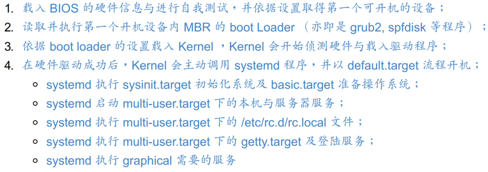

- **BIOS/boot loader/kernel 载入**
- **Boot Loader 最主要功能是要认识操作系统的文件格式并据以载入核心到内存中去执行**
    - setp 1: MBR(grub2) --> kernel file --> booting
    - step 2: MBR(grub2) --> boot sector(Windows loader) --> Windows kernel --> booting
    - step 3: MBR(grub2) --> boot sector(grub2) --> kernel file --> booting
- **载入核心侦测硬件与 initramfs 功能**
- **虚拟文件系统(Initial RAM Disk or Initial RAM Filesystem)一般使用的文件名为 /boot/initrd 或 /boot/initramfs, 这个文件的特色是,也能够通过 boot loader 来载入到内存中,然后这个文件会被解压缩并且在内存当中仿真成一个根目录,且此仿真在内存当中的文件系统能够提供一支可执行的程序,通过该程序来载入开机过程中所最需要的核心模块, 通常这些模块就是 USB, RAID, LVM, SCSI 等文件系统与磁盘接口的驱动程序啦！ 等载入完成后,会帮助核心重新调用 systemd 来开始后续的正常开机流程**


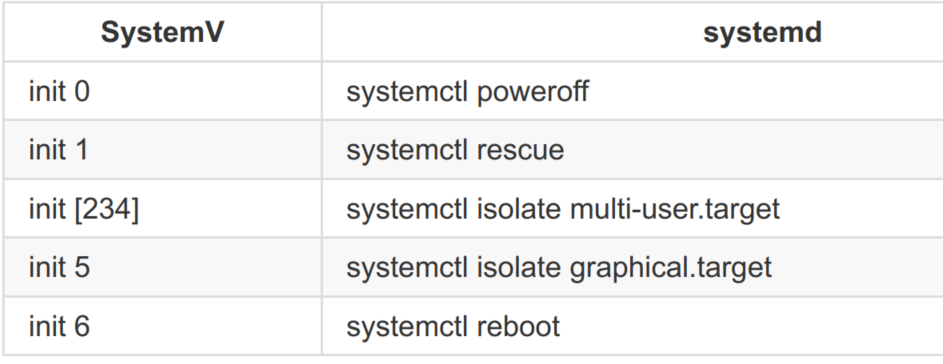

- **系统的第一个进程 systemd; 使用 default.target 进入开机程序分析**
- **systemd 开机流程分析**
- **https://www.junmajinlong.com/linux/systemd/systemd_bootup/**
- **开机过程会用到的主要配置文件:**
    - 关于模块: /etc/modprobe.d/.conf; /etc/modules-load.d/.conf
    - 驱动程序: /etc/sysconfig/\*

- **核心与核心模块**
    - 能够成功的驱动主机的硬件配备,核心(kernel),核心一般都是压缩文件,因此在使用核心之前,解压缩,才能载入内存当中
    - 应付日新月异的硬件,目前的核心都是具有"可读取模块化驱动程序"的功能,亦即是所谓的"modules(模块化)"的功能
    - 较新的硬件, 通常都需要硬件开发商提供驱动程序模块
    - 核心： /boot/vmlinuz 或 /boot/vmlinuz-version
    - 核心解压缩所需 RAM Disk： /boot/initramfs (/boot/initramfs-version)
    - 核心模块： /lib/modules/version/kernel 或 /lib/modules/$（ uname -r） /kernel
    - 核心源代码： /usr/src/linux 或 /usr/src/kernels/ (要安装才会有,默认不安装)
    - 如果该核心被顺利的载入系统当中了, 那么就会有几个信息纪录下来：核心版本: /proc/version; 系统核心功能: /proc/sys/kernel/
    - 新的硬件,操作系统不支持:重新编译核心,并加入最新的硬件驱动程序源代码; 将该硬件的驱动程序编译成为模块,在开机时载入该模块
- **核心模块意见的依赖性 /lib/modules/$(uname -r)/kernel; /lib/modules/$(uname -r)/modules.dep; depmod command**
    - arch: 与硬件平台有关的项目, 例如 CPU 的等级
    - crypto: 核心所支持的加密的技术, 例如 md5 或 des 等等
    - drivers: 一些硬件的驱动程序, 例如显卡/网卡/PCI 相关硬件等等
    - fs: 核心所支持的 filesystems, 例如 vfat, reiserfs, nfs 等等
    - lib: 一些函数库
    - net: 与网络有关的各项协定数据, 还有防火墙模块(net/ipv4/netfilter/*)
    - sound: 与音效有关的各项模块
- **lsmod command; 查询目前核心载入多少模块(模块名称[Module]/模块大小[size]/此模块是否被其他模块所使用[Used by])**
- **modinfo command; 查询模块信息**
- **modprobe command 载入/移除模块, 会主动搜寻 modules.dep 克服模块的依赖性**
- **insmod/rmmod command 载入/移除模块, 不会主动搜寻 modules.dep, 完全由使用者自行载入一个完整文件名的模块**
- **核心模块的额外参数设置: /etc/modprobe.d/\*conf**
- **boot loader two stage:**
- **boot loader two stage:**
    - Stage 1: 执行 boot loader 主程序
    - Stage 2: 主程序载入配置文件
    - configure file: /boot/grub2
- **grub2 配置文件 /boot/grubs/grub.cfg**
- **grub2 配置文件维护 /etc/default/grub; /etc/grub.d**
- **chainloader 方式移交 loader 控制权**
- **initramfs 重要性和创建新的 initramfs 文件; dracut command**
- **grub2 insatll and test; 开机前的额外功能修改**
- **开机过程的问题解决: 进入 rescue 模式处理**
- **忘记 root 密码的解决之道**
- **直接开机就以 root 执行 bash 的方法**
- **因文件系统错误而无法开机**

## Lecture 21: 基础系统设置与备份策略

- **系统基本设置**
    - 网络设置(手动设置与HDCP自动获取)
    - 日期与时间设置
    - 语系设置
    - 防火墙简易设置
- **系统内置 dmidecode 解析硬件配备; dmidecode -t 1**
- **lspci command 列出整个 PC 系统的 PCI 接口设备**
- **lsusb command 列出目前系统上各个 USB 端口的状态, 与连接的 USB 设备**
- **iostat command 与 vmstat 类似, 可以实时列出整个 CPU 与周边设备的 Input/Output 状态**
- **smartd (Self-Monitoring, Analysis and Reporting Technology System) 服务; 了解磁盘的健康状态; smartctl command**
- **造成系统损毁以及备份: 硬件问题; 软件问题; 人为问题**
- **Linux 数据具有备份的意义; 关键数据备份; 完整备份(Full backup)**
- **备份的种类, 频率和工具的选择**
- **完整备份之累积备份 (Incremental backup); dd, cpio, xfsdump/xfsrestore tools**
- **完整备份之差异备份 (Differential backup); rsync 进行镜像备份**
- **shell scripts 完成周期性自动化备份流程**

## Lecture 22: 软件安装: 源代码与 Tarball

- **binary executable program; Compiler; library**
- **GUN Linux; GPL授权; 开放源代码**
- **file /bin/bash; 查看文件是否为可执行文件(binary program)**
- **函数库(library): 静态库(static)和动态库(dynamic)**
- **gcc compile; make; Makefile**
- **通常软件开发商都会写一支侦测程序来侦测使用者的作业环境, 以及该作业环境是否有软件开发商所需要的其他功能, 该侦测程序侦测完毕后, 就会主动的创建这个 Makefile 的规则文件啦！通常这支侦测程序的文件名为 configure 或者是 config**
    - 是否有合适的编译器可以编译本软件的程序源代码码
    - 是否已经存在本软件所需要的函数库, 或其他需要的相依赖的软件
    - 操作系统平台是否适合本软件, 包括 Linux 的核心版本
    - 核心的表头定义文件(header include)是否存在(驱动程序必须要的侦测)
- **源代码通过打包压缩后的文件: Tarball 软件包**
    - 原始源代码文件
    - 侦测程序文件(configure/config)
    - 本软件的简易说明与安装说明(INSTALL/README)
- **直接以源代码通过编译来安装和升级**
- **直接以编译好的 binary program 来安装和升级**
- **Red Hat系列(Fedora/CentOS) 以 RPM 软件管理机制和 yum 线上更新模式**
- **Debian系列(Ubuntu) 以 dpkg 软件管理机制和 apt 线上更新模式**
- **Arch系列(Manjaro) 以 pacman 软件管理机制和 pacman 线上更新模式**
- **编辑源代码 --> compile --> link --> install --> execute --> static/dynamic library**
- **gcc tool chain: 预处理 --> 编译 --> 汇编 --> 链接**
- **https://www.gnu.org/software/make/manual/make.html**
- **https://seisman.github.io/how-to-write-makefile/**
- **基础编译环境: gcc compiler; make; autoconfig; Kernel provided static/dynamic libray and include**
    - step1 ./configure(INSTALL/README)
    - step2 make clean
    - step3 make
    - step4 make install
- **Static library**
    - 扩展名 (.a), libxxx.a
    - 编译行为, 直接编译到可执行程序中, 编译后的文件 size 大
    - 独立执行的状态
    - 升级时需要重新编译
- **Dynamic library**
    - 扩展名 (.so), libxxx.so
    - 编译行为, 编译的时候只需要 pointer 指向即可, 编译后的文件 size 小
    - 不能独立执行, 执行时需要依赖动态库
    - 升级时不需要重新编译(只需升级需要的动态库)
- **将常用的动态函数库先载入内存(cache 高速缓存), 当需要使用时，比起从磁盘读出的速度很快**
- **ldconfig; /etc/ld.so.conf**
    1. step1 在 /etc/ld.so.conf 写入"想要读入 cache 中的动态函数库所在的目录(不是文件)"
    2. step2 利用 ldconfig command 将 /etc/ld.so.conf 数据读入 cache 中
    3. step3 同时将数据记录一份在 /etc/ld.so.cache 文件中 
- **ldconfig 还可以用于判断动态函数库的链接信息**
- **ldd command 解析程序的动态函数库; ldd [-vdr] [filename]**
- **检验软件正确性: MD5/sha1/sha256; 每个文件独特的指纹验证数据**
- **md5sum/sha1sum/sha256sum [-bct] filename; 计算出对应指纹的校验码**

## Lecture 23: 软件安装 RPM, SRPM, YUM

- **Linux 包管理工具: RPM(yum, CentOS); DPKG(apt, Ubuntu); Pacman(pacman, Manjaro)**
- **RPM (RedHat Package Manager), xxx.rpm; Source RPM 文件里面包含源代码, xxx.src.rpm**
- **软件名称-版本信息-释放版本次数-操作系统平台-后缀扩展名**
- **目前 distrbutions 释放软件时, 都有一般使用和开发使用(dev/devel)**
- **yum 线上机制; 软件库清单机制; update; upgrade; install**

```bash
# RPM install; -i 安装; -v 显示安装信息; -h 显示安装精度
rpm -ivh software.rpm

# RPM 升级和更新 (upgrade/freshen)
rpm -Uvh software.rpm
rpm -Fvh software.rpm

# RPM 查询 (query)
rpm -q software

# RPM 验证和数码签章 (verify/signature); 
rpm -Va

# public key 软件的签章的安装后才能安装该软件
# GUNPG (GUN Privacy Guard, GPG)

# RPM 反安装和重建数据库 (erase/rebuilddb)
rpm -e software

# yum 查询功能 [list/info/search/provides/whatprovides]
yum list software
yum searhc software

# yum 安装和升级功能 [install/update]
yum install software
yum update software

# yum 移除功能 [remove]
yum remove software

# yum 配置文件
# /etc/yum.repos.d/ContOS-Base.repo

# 全系统自动升级; kernel 需要重新启动主机
yum -y update
```

- **yum 软件群组功能**
- **EPEL/ELRepo 外挂软件以及自订配置文件**

## Lecture 24: X Window 设置介绍

- **Linux 的图形接口称之为 X Window System(Server/Client), 简称 X or X11**
- **图形接口 (Graphical User Interface, GUI)**
- **X Window System 最早由 MIT (Massachusetts Institute of Technology, 麻省理工学院) 在1984年发展**
- **Window Manager (WM, 窗口管理员), WM 即是 X client**
- **WM: GNOME(GUN Network Object Model Environment); https://www.gnome.org/**
- **WM: KDE(K Desktop Environment); https://kde.org/**
- **WM: twm(Tab Window Manager); http://www.xwinman.org/vtwm.php**
- **WM: XFCE(XForms Common Environment); https://www.xfce.org/**
- **X Server 配置文件解析与设置**
    - 提供的屏幕字体: /usr/share/X11/fonts/
    - 显卡的芯片组: /usr/lib64/xorg/modules/drivers/
- **显示器参数微调**
- **显卡驱动程序安装(Nvidia/AMD/Intel)**

## Lecture 25: Linux kernel 编译和管理

- **kernel and get kernel source code**
- **kernel module**
- **https://mirrors.edge.kernel.org/pub/linux/kernel/**
- **kernel source code 加压缩/安装/查看**

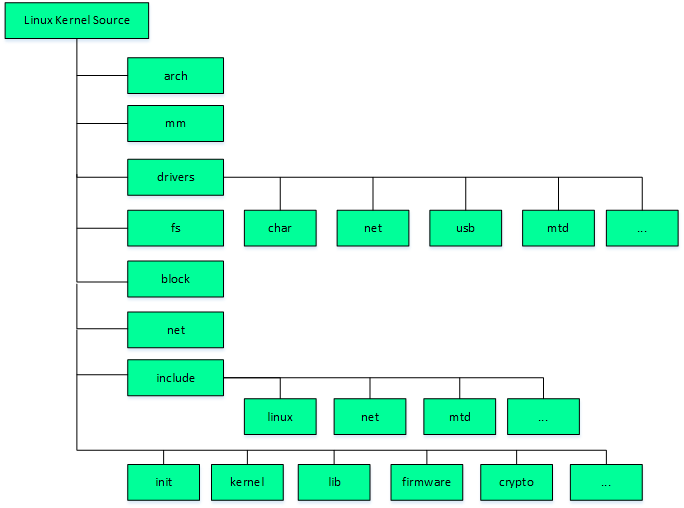

- **kernel compile and section function**
    1. 硬件环境检查和核心功能要求
    2. make mrproper 保持干净源代码
    3. make XXconfig 选择核心功能
    4. 核心功能的细项选择
    5. kernel compile and kernel modules compile
    6. install modules
    7. install grub2
- **以 QT 为图形接口的图形化接口显示; 以 GTK 为图形接口的图形化接口显示**
- **单一核心模块编译(某一个硬件模块的驱动)**
- **核心(kernel), 核心模块(kernel modules), 驱动程序模块(drives), 核心源代码(kernel source code)与头文件(header file)的相关性**


## About Author

### Talk is cheap, show me the code.
&emsp;&emsp;&emsp;&emsp;&emsp;&emsp;&emsp;&emsp;&emsp;&emsp;&emsp;&emsp;&emsp;&emsp;&emsp;&emsp;&emsp;&emsp;——Linus Torvalds

### 掌中星辰转日月，手心苍穹天外天。
&emsp;&emsp;&emsp;&emsp;&emsp;&emsp;&emsp;&emsp;&emsp;&emsp;&emsp;&emsp;&emsp;&emsp;&emsp;&emsp;&emsp;&emsp;——云主宰苍穹

### Stay Hungry, Stay Foolish.
&emsp;&emsp;&emsp;&emsp;&emsp;&emsp;&emsp;&emsp;&emsp;&emsp;&emsp;&emsp;&emsp;&emsp;&emsp;&emsp;&emsp;&emsp;——Steve Jobs

--------------------------------------------------------------------------------

- Mail：2694048168@qq.com
- Weibo：云主宰苍穹
- GitHub: https://github.com/2694048168/
- Gitee：https://gitee.com/weili_yzzcq/

--------------------------------------------------------------------------------
