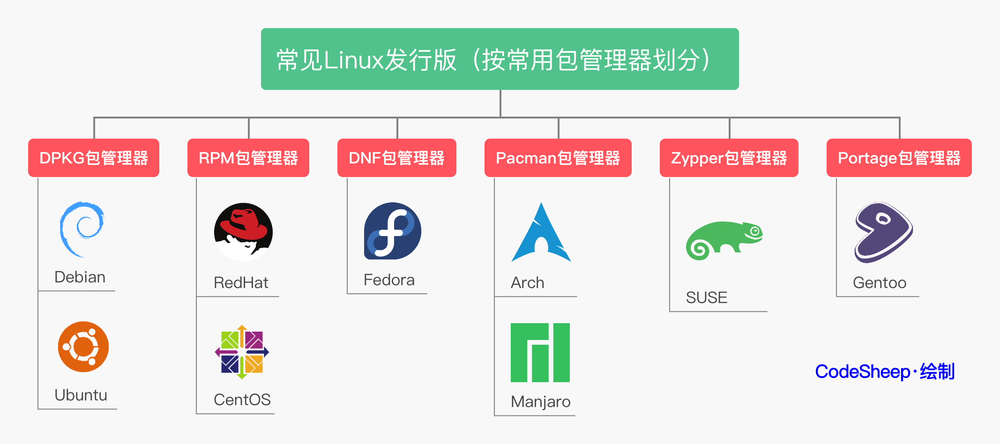

--------------------------------------------------------------------------------

## Linux Operating System



## Linux Command Tricks

```shell
# 快速回到上一次的目录
cd -

# 快速回到 home/user 目录
cd ~

# 终端清屏
clear
# 使用快捷键 Ctrl + l

# 快速重启 shell
reset

# 关闭终端 shell
# 使用快捷键 Ctrl + d

# pushd 将一个特定的目录压入栈中保存 and popd 将栈中目录弹出, 回到特定目录
pushd /etc/gcc
# 经过一系列的目录路径改变后, 直接回到栈中目录
popd

# Ctrl + z 快速将一个任务放入后台, 临时需要终端处理其他任务后, fg 继续该任务
# 特别是在配置一些文件变量的时候，需要利用终端查看一下路径啥的
top
Ctrl + z
fg

# 忘了给 command 添加 sudo 权限
apt update
# !! 表示上一条命令
sudo !!

# Ctrl + a 快速移动到行首，添加一些指令 sudo 之类的
# Ctrl + e 快速移动到行尾，添加一些内容
# Ctrl + u 快速删除整行命令
# Ctrl + p 快速选择历史命令
# 上下方向键可以快速查看历史命令

# 查看历史命令 每条执行的指令有一个 number 编号
history
# !number_command
!42

sudo apt install cmatrix
cmatrix
# F11 开启/关闭 全屏

# Ctrl + Shift + [+] 快速增大终端字体
# Ctrl + [-] 快速减小终端字体
reset # 恢复终端

sudo apt update; sudo apt install build-essential
# 两个指令中间是否相关依赖 
sudo apt update && sudo apt install build-essential

mount | column -t

```


## About Author

### Talk is cheap. Show me the code.
&emsp;&emsp;&emsp;&emsp;&emsp;&emsp;&emsp;&emsp;&emsp;&emsp;&emsp;&emsp;&emsp;&emsp;&emsp;&emsp;&emsp;&emsp;——Linus Torvalds

### 掌中星辰转日月，手心苍穹天外天。
&emsp;&emsp;&emsp;&emsp;&emsp;&emsp;&emsp;&emsp;&emsp;&emsp;&emsp;&emsp;&emsp;&emsp;&emsp;&emsp;&emsp;&emsp;——云主宰苍穹

### Stay Hungry, Stay Foolish.
&emsp;&emsp;&emsp;&emsp;&emsp;&emsp;&emsp;&emsp;&emsp;&emsp;&emsp;&emsp;&emsp;&emsp;&emsp;&emsp;&emsp;&emsp;——Steve Jobs

--------------------------------------------------------------------------------

- Mail：2694048168@qq.com
- Weibo：云主宰苍穹
- GitHub: https://github.com/2694048168/
- Gitee：https://gitee.com/weili_yzzcq/

--------------------------------------------------------------------------------
