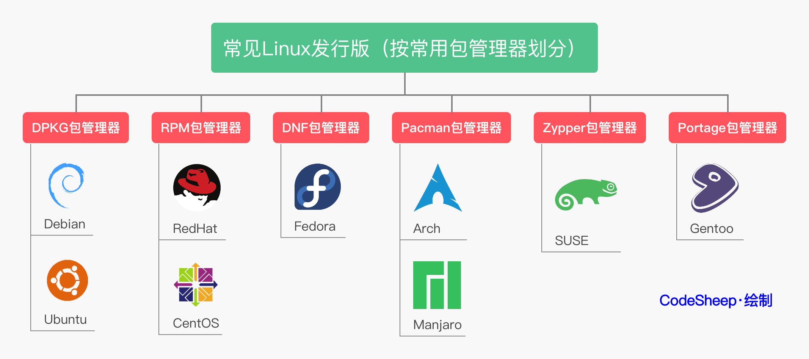

> Ubuntu使用过程中常用的配置和命令

### 首次安装的基本配置
```shell
# 0. 设置终端的大小和位置
# 打开一个新的终端窗口, 在 preference 设置字体大小和终端大小
gsettings set org.gnome.mutter center-new-windows true
# 按回车键 即可设置所有打开应用均默认在屏幕中间

# 1. 设置 root 密码, 输入并确定即可(默认不回显)
sudo passwd
# 切换到 root 用户, 测试密码
su root

# 2. 更换软件源到国内镜像后, 更新软件源列表信息本地索引
sudo apt update

# 3. 安装 ssh
sudo apt install openssh-server
# 配置SSH
sudo vim /etc/ssh/sshd_config
sudo gedit /etc/ssh/sshd_config
# 找到下面内容, 禁止 root 用户远程登录
# PermitRootLogin yes
# PasswordAuthentication yes

# 设置开机自启动
sudo systemctl enable ssh
sudo systemctl is-enabled ssh
# 查看SSH服务状态
sudo systemctl status ssh

# 4. 查看IP, 远程ssh连接
ip addr
ssh weili@192.168.188.129
# 输入 yes 授权, 然后输入该用户的密码即可登录
ssh root@192.168.188.129

# 根据需要设置防火墙
sudo ufw allow ssh
```

### SSH 上传下载文件
```shell
# 在linux下一般用scp这个命令来通过ssh传输文件
# 1、从服务器 下载文件
scp username@servername:/path/filename /var/www/local_dir
scp root@192.168.0.101:/var/www/test.txt  ./local_dir

# 2、上传本地文件到服务器
scp /path/filename username@servername:/path   
scp /var/www/test.php  root@192.168.0.101:/var/www/

# 3、从服务器下载整个目录
scp -r username@servername:/var/www/remote_dir/ /var/www/local_dir
scp -r root@192.168.0.101:/var/www/test  /var/www/  

# 4、上传目录到服务器
scp  -r local_dir username@servername:remote_dir
scp -r test  root@192.168.0.101:/var/www/

```

### Tmux
```shell
# install Tmux terminal 
sudo apt install tmux

# 进入 tmux
tmux

# tmux 默认的前置操作是 CTRL+b
# %(Shift)	   # 左右切分 Pane
# "(Shift)	   # 上下切分 Pane
# space键	   # 切换 Pane 布局
# 使用方向键：先按前缀Ctrl-b，然后按方向键（上下左右）即可切换到对应方向的pane
# 使用快捷键重复上次的pane切换：Ctrl-b;（分号）可以切换到上次活动的pane
# 使用快捷键快速切换：Ctrl-b o可以按顺序切换到下一个pane

```


### 包管理工具

- [**nala**](https://gitlab.com/volian/nala)
- [**man package nala**](https://manpages.ubuntu.com/manpages/noble/en/man8/nala.8.html)
- [**man package apt**](https://manpages.ubuntu.com/manpages/noble/en/man8/apt.8.html)

```shell
# apt 更换为 nala
# 1. 安装 nala
sudo apt update && sudo apt install nala

# 2. nala 选择最佳镜像源, 需要等待一会测试
sudo nala fetch
# 根据索引, 以空格方式输入想要的镜像源即可

# 3. 利用 nala 并行下载更新所有软件
sudo nala update && sudo nala upgrade

# 利用 dpkg 管理 deb 格式
sudo dpkg -i xxx.deb  # 安装 deb 格式的软件
sudo dpkg -r xxx      # 卸载 deb 格式安装的软件

# install gcc-12/g++12 on Ubuntu22
# install gcc-14/g++14 on Ubuntu24
sudo apt install gcc-12
sudo apt install g++-12
# sudo update-alternatives --install 切换系统 gcc/g++ 版本
sudo update-alternatives --install /usr/bin/gcc gcc /usr/bin/gcc-12 60 --slave /usr/bin/g++ g++ /usr/bin/g++-12
gcc --version
g++ --version
```

### WSL 配置代理
由于 Linux 子系统也是通过 Windows 访问网络, 所以 Linux 子系统中的网关指向的是 Windows, DNS 服务器指向的也是 Windows, 基于这两个特性, 可以将 Windows 的 IP 读取出来.
```shell
# 1. WSL2 中配置的代理要指向 Windows 的 IP;
# 2. Windows 上的代理客户端需要允许来自本地局域网的请求;
cat /etc/resolv.conf                                                                                             
# This file was automatically generated by WSL. To stop automatic generation of this file, add the following entry to /etc/wsl.conf:
# [network]
# generateResolvConf = false
nameserver 172.26.144.1

# 可以看到 DNS 服务器是 172.26.144.1,通过环境变量 ALL_PROXY 配置代理
export ALL_PROXY="http://172.25.48.1:7890"
# 7890 是 Windows 上运行的代理客户端的端口,记得要在 Windows 代理客户端上配置允许本地局域网请求.

# 一键配置脚本 bash 脚本,可以轻松的实现一键配置代理
touch .proxyrc

#!/bin/bash
host_ip=$(cat /etc/resolv.conf |grep "nameserver" |cut -f 2 -d " ")
export ALL_PROXY="http://$host_ip:7890"

# 对当前目录下的 .proxyrc 文件的所有者增加可执行权限
chmod u+x .proxyrc
# 生效环境变量
source .proxyrc
```

解决"wsl: 检测到 localhost 代理配置，但未镜像到 WSL。NAT 模式下的 WSL 不支持 localhost 代理"
```shell
# 在Windows中的C:\Users\<your_username>目录下创建一个.wslconfig文件，然后在文件中写入如下内容
[experimental]
autoMemoryReclaim=gradual  
networkingMode=mirrored
dnsTunneling=true
firewall=true
autoProxy=true

# 关闭重启即可 
wsl shutdown
wsl
```

### WSL 配置 SSH
```shell
sudo service ssh start
sudo service ssh status
sudo ps -e | grep ssh

# 通过systemctl可以设置服务的启动和关闭以及开机启动,
# 使用systemctl要求系统要以systemd进行启动才可以使用的,
# 在WSL的Ubuntu默认是没有以systemd启动的.
sudo vim /etc/wsl.conf
# 然后输入如下内容：
# [boot]
# systemd=true

wsl --shutdown
wsl shutdown
wsl

# 设置开机自启动
sudo systemctl enable ssh
sudo systemctl is-enabled ssh
# 查看SSH服务状态
sudo systemctl status ssh
```

### shell

- [**zsh**](https://www.zsh.org/)
- [**on my zsh**](https://ohmyz.sh/)
- [**on my zsh Themes**](https://github.com/ohmyzsh/ohmyzsh/wiki/Themes)

```shell
# 将默认shell工具 bash 配置为 zsh
# 1. 检查当前可用的 shell
cat /etc/shells
# bash 的配置文件 .bashrc

# 2. 查看当前使用的shell
echo $SHELL

# 3. 安装 zsh shell
sudo nala install zsh -y

# 4. 查看 shell 版本 切换默认使用 zsh
zsh --version
sudo chsh -s $(which zsh)
# root 用户默认使用 bash
sudo chsh -s $(which bash) root
sudo usermod -s /bin/zsh weili
sudo usermod -s $(which zsh) weili

# 注销当前用户重新登录, 验证当前默认 Shell
# 再次打开终端, 会选择生成配置文件 .zshrc
# 5. 安装 git 工具
sudo nala install git
git --version

# 6. 安装 oh-my-zsh, 配置 zsh
sh -c "$(wget https://raw.githubusercontent.com/ohmyzsh/ohmyzsh/master/tools/install.sh -O -)"
sh -c "$(curl -fsSL https://raw.githubusercontent.com/ohmyzsh/ohmyzsh/master/tools/install.sh)"

# 7. 下载 zsh-syntax-highlighting 语法高亮插件
git clone https://github.com/zsh-users/zsh-syntax-highlighting.git ${ZSH_CUSTOM:-~/.oh-my-zsh}/plugins/zsh-syntax-highlighting

# 下载 zsh-autosuggestions 自动提示插件
git clone https://github.com/zsh-users/zsh-autosuggestions ${ZSH_CUSTOM:-~/.oh-my-zsh/custom}/plugins/zsh-autosuggestions

# 配置 .zshrc文件 更换默认主题 alanpeabody
vim ~/.zshrc
gedit ~/.zshrc
# 添加内容
plugins=(git zsh-syntax-highlighting zsh-autosuggestions)

# 配置生效
source ~/.zshrc
```

### VSCode 终端远程连接
- [**Windows Terminal and on my posh**](https://ohmyposh.dev/)
```shell
# Windows 安装 Terminal + on my posh
# 1. VSCode 安装插件, Extension ID
# ms-vscode-remote.remote-ssh

# 2. 选择插件加号, 即可添加ssh配置到文件
ssh weili@192.168.188.129

# 3. 选择插件的设置按钮, 即可查看远端ssh配置
# 4. 刷新按钮点击, 即可刷新添加的ssh远端, 连接输入用户密码
# 5. 第一次连接会在远端安装 VSCode server, 需要点时间
# 6. 连接成功后, VSCode 左下角有明显标志
# 7. 需要在远端开发, 注意VSCode 的本地插件和远端插件的区别
```
