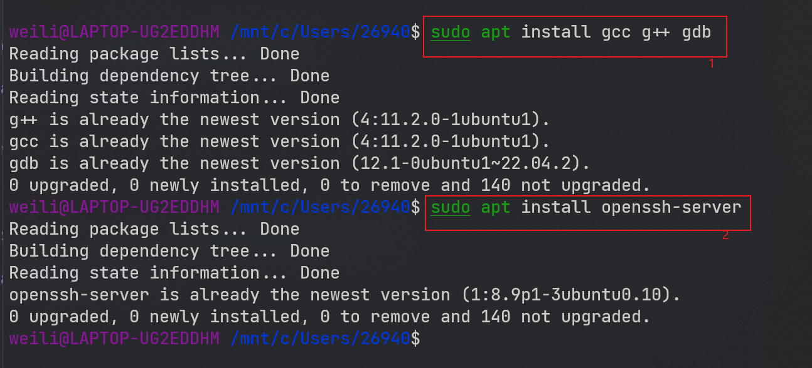
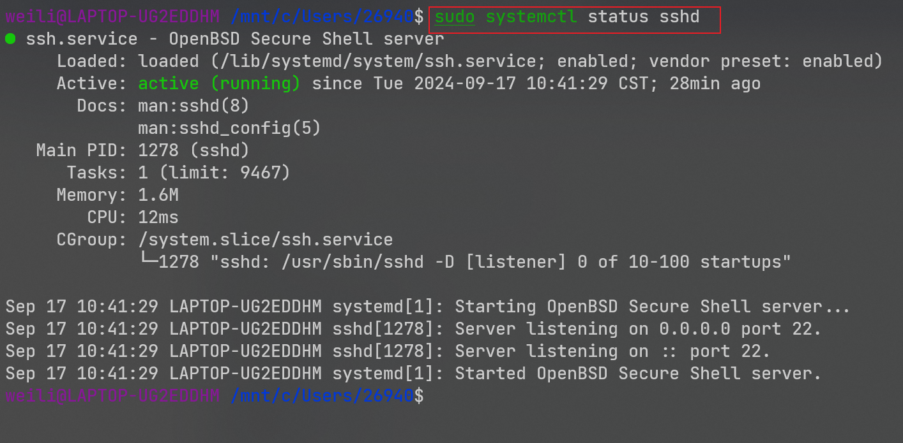
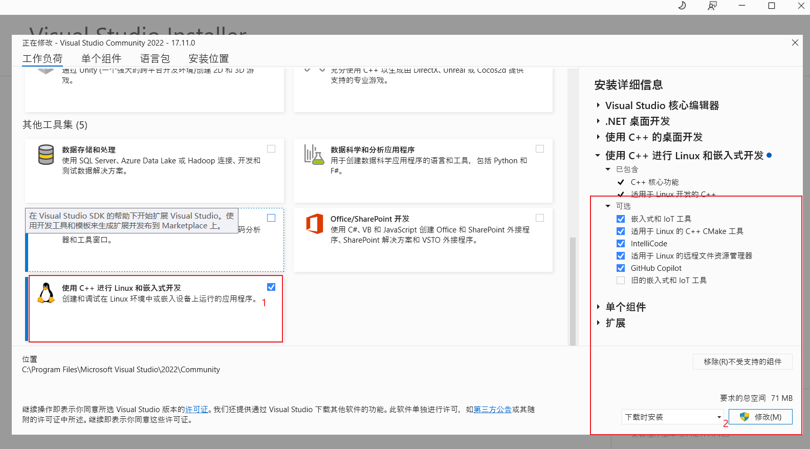
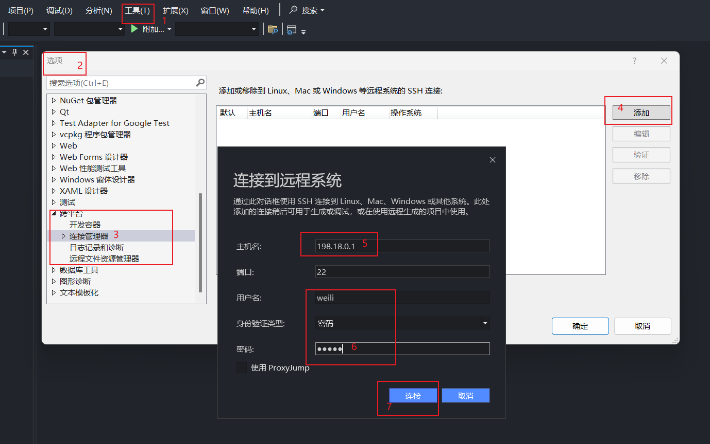
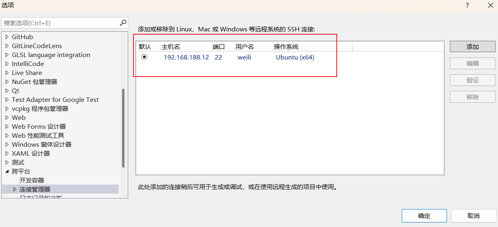
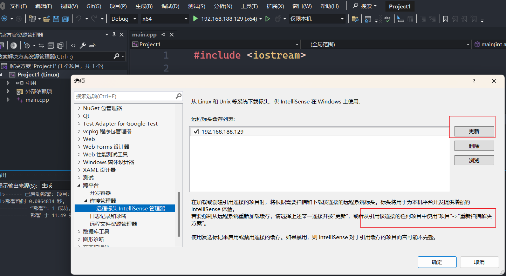
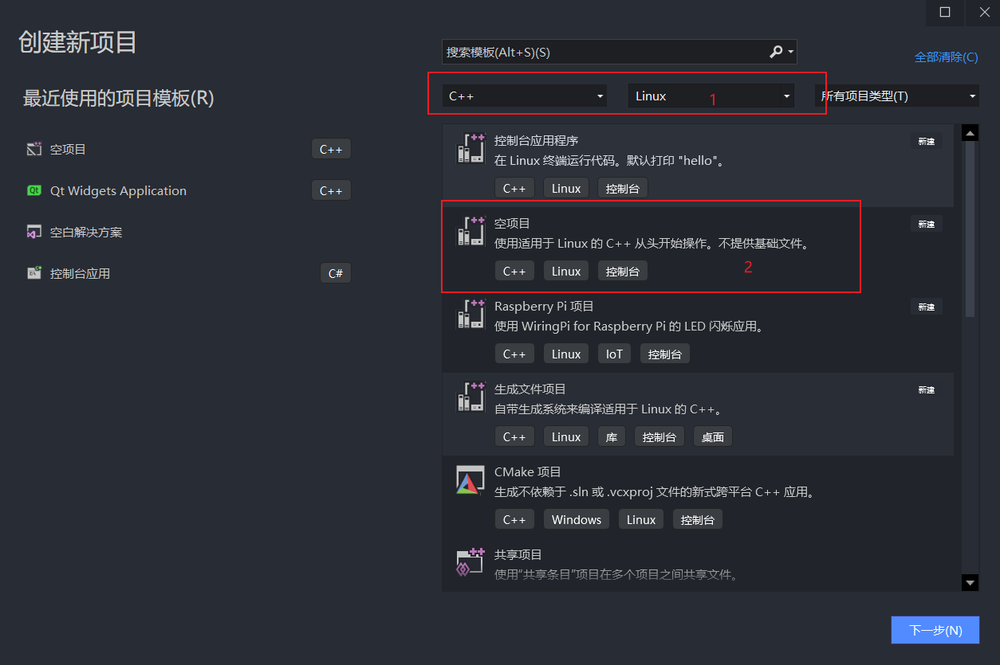
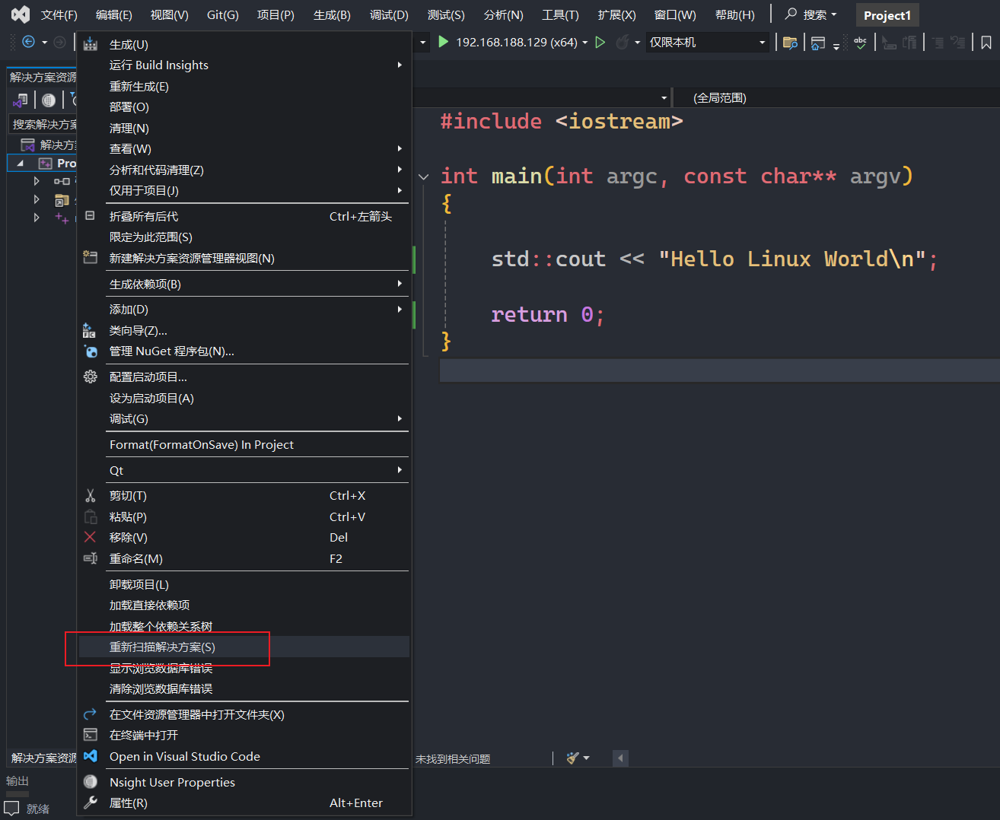

### Visual Studio(VS) 配置远程 Linux 开发环境

#### 远程 Linux 配置

```shell
# Step1. install base-develop toolchain
# openssh-server、g++、gdb 和 make. 仅CMake项目需要 ninja-build
sudo apt install gcc g++ gdb gdbserver make
sudo apt install cmake ninja-build

# Step2. install ssh tool and config
# https://ubuntu.com/server/docs/openssh-server
sudo apt install openssh-server

# Step3. check the remote Linux IP 
ip address
ip addr
ip a
# or install net tool
sudo apt install net-tools
ifconfig
```




#### Visual Studio(VS) 配置

- **Step1.** Visual Studio Installer update Linux-develop

- **Step2.** Visual Studio Config the setting

- **Step3.** Visual Studio SSH Status


#### Visual Studio(VS) 开发

- **Step1.** Visual Studio Develop

- **Step2.** Visual Studio Create Linux Project

- **Step3.** Visual Studio Intellisense

- **Step4.** /home/weili/projects/ 远端Linux生成程序和代码位置
