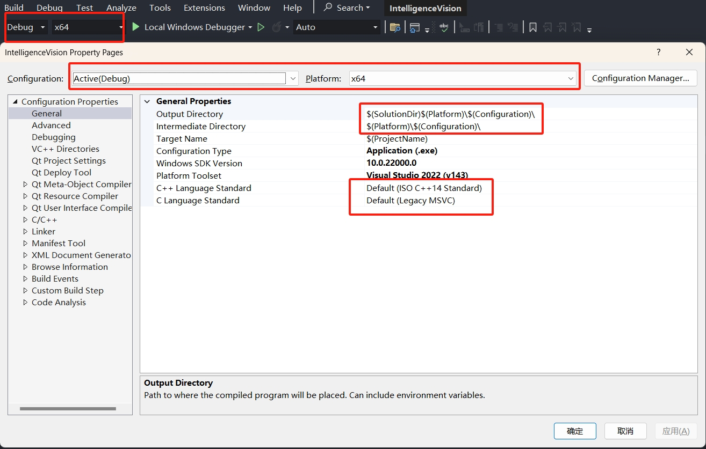

## 工作效率翻倍的 VSCode 配置

- &ensp;Title: 工作效率翻倍的 VSCode 配置
- &ensp;Tags: Visual Studio Code, VSCode
- &ensp;Type: Mini-Survey
- &ensp;Author: [Wei Li](https://2694048168.github.io/blog/#/) (weili_yzzcq@163.com)
- &ensp;DateTime: 2024-10-20

> Visual Studio Code(VSCode) 其灵活性和强大的扩展性而备受欢迎, 通过安装各种插件, 开发者可以根据自己的需求定制工作环境, 从而提高生产力和代码质量, 使得开发过程更加高效和愉悦. 配置个人开发时常用插件，优化工作流程、增强代码编辑体验, 并提升项目管理效率. 

### Overview of Visual Studio Code Configure
- **基本配置**
- **主题外观**
- **编码提效**
- **功能插件**

### Configuration Properties

    

- 确定配置所生效的Debug/Release版本, 确定配置平台x64/win32
- 配置项目输出的路径, 生成的中间文件路径, 采用VS提供的宏变量设置相对路径
- 设置生成项目的名称, 一般会把Debug版本新增一个后缀, _d
- 设置生成项目的类型, 可执行程序(exe), 静态块(lib), 动态库(dll)
- 设置平台工具集, 每一个VS版本都对应一个工具集, 可以在VS Installer下载多个工具集版本, VS2022-v143
- 设置Windows SDK版本, 根据开发需求统一, 可以在VS Installer下载多个SDK版本
- 根据团队开发需求统一, 设置相机所使用的C++语言标准, C语言标准
