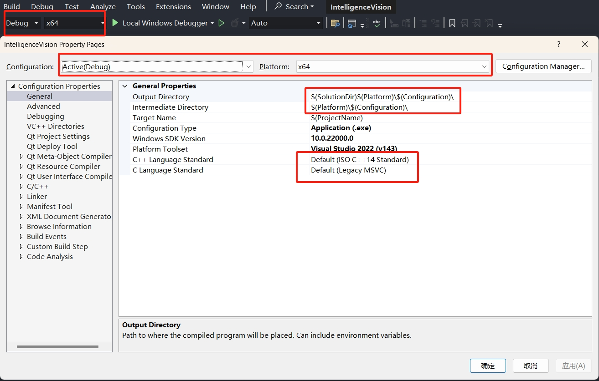
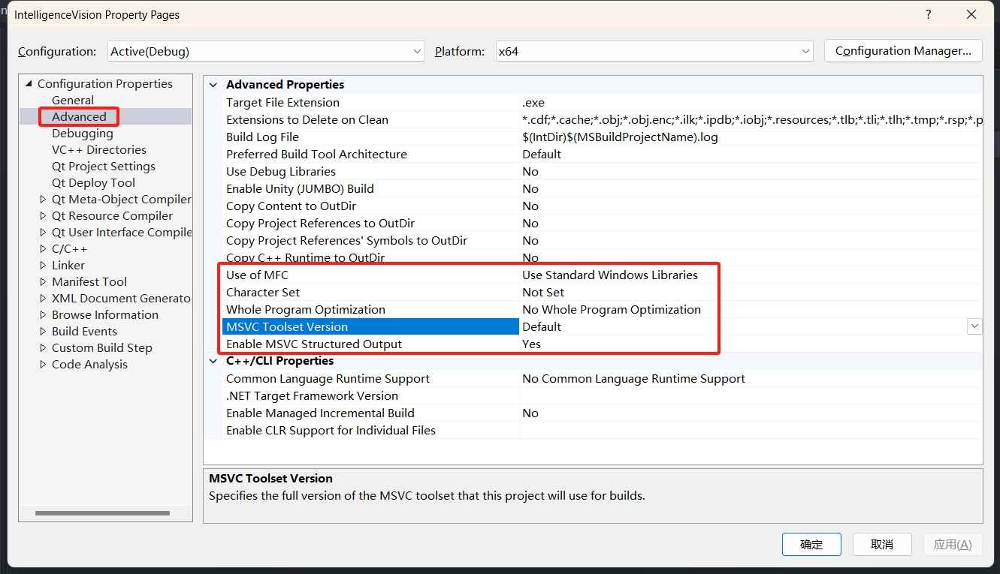
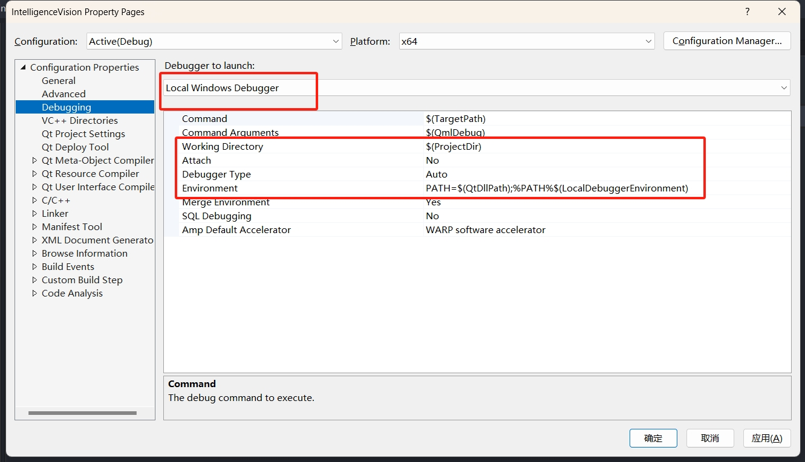
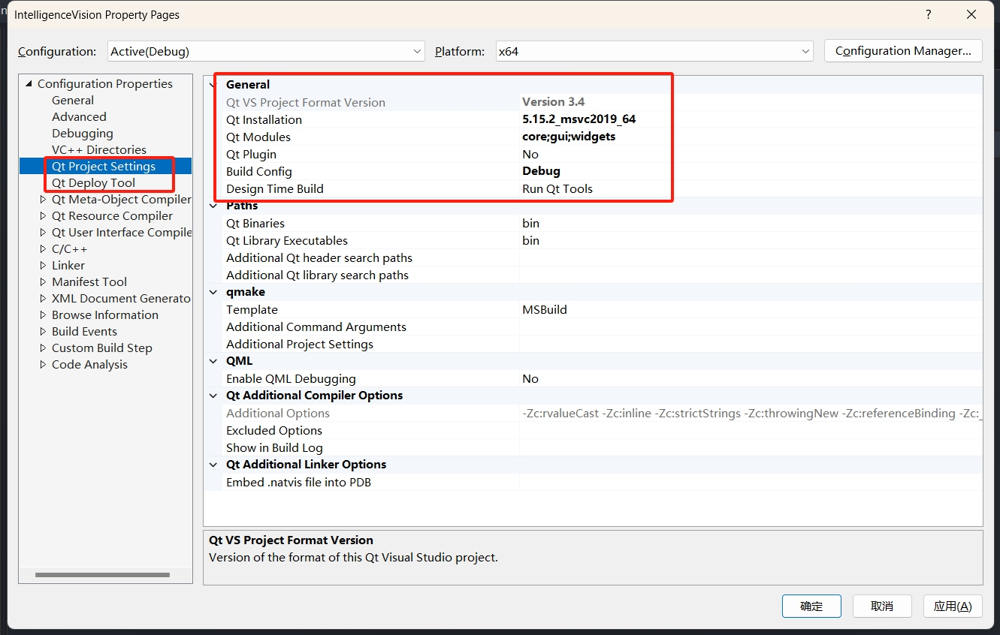
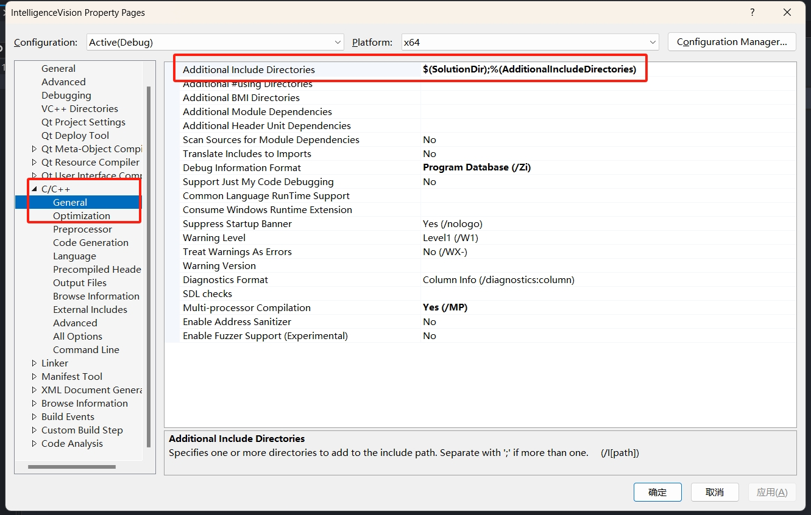
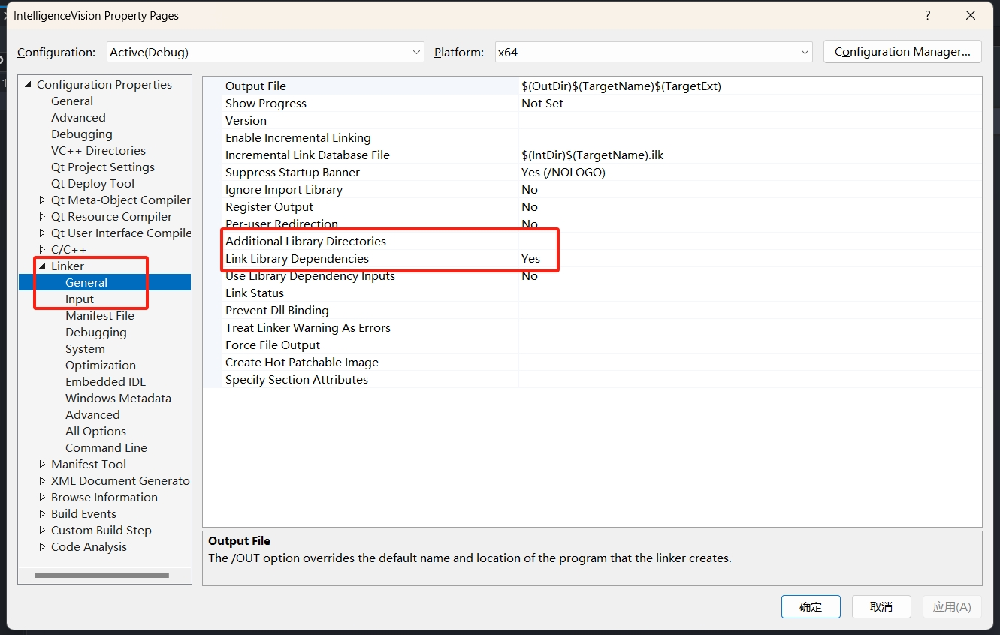
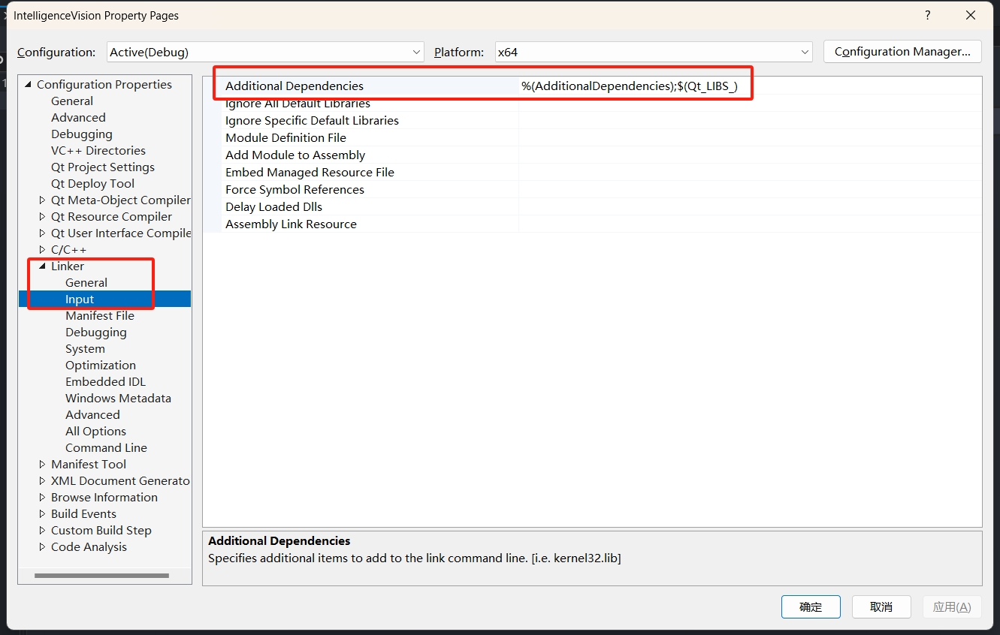
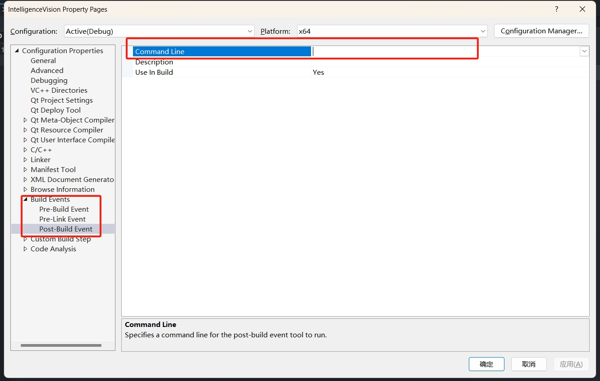
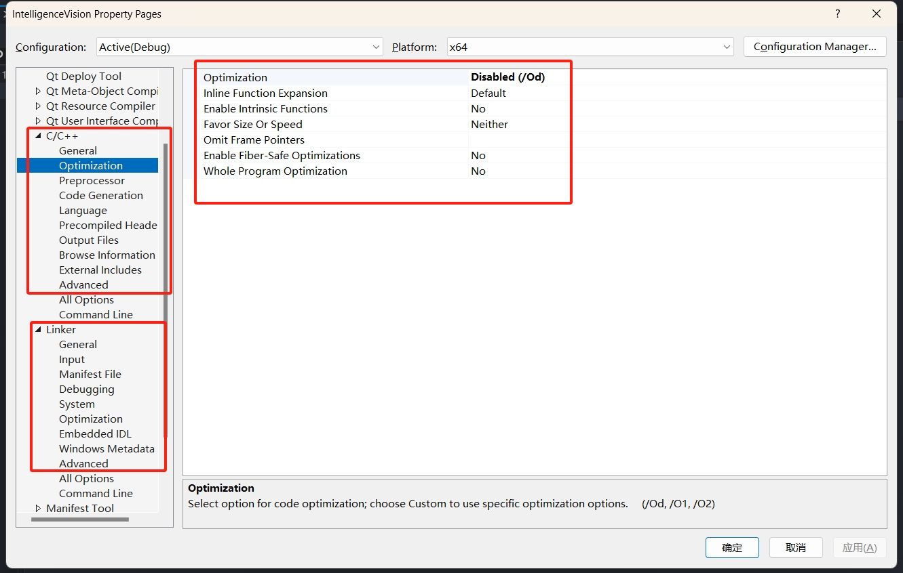

## Project configure of Visual Studio 2022

- &ensp;Title: Project configure of Visual Studio 2022
- &ensp;Tags: Visual Studio 2022
- &ensp;Type: Mini-Survey
- &ensp;Author: [Wei Li](https://2694048168.github.io/blog/#/) (weili_yzzcq@163.com)
- &ensp;DateTime: 2024-03

> 在Window平台下利用Visual Studio进行开发, 针对解决方案和项目的属性配置十分重要. 深入理解C++项目构建过程中的编译和链接, 每一步设置配置都是细节和对技术点的理解.

### Overview of Visual Studio
- 理解 Solution and Project 的区别和联系;
- 理解平台工具集和Windows SDK版本, 以及配置方式
- 理解 Debug and Release 版本的属性配置的区别和使用场景;
- 配置头文件路径, 库路径, 链接静态/动态库(导入库);
- 配置相对路径, Visual Studio提供的宏变量;
- 项目配置完成, 源文件依然存在红色波浪线报错, 重新扫描解决方案;
- 程序执行路径配置, 运行时依赖动态库DLL的自动生成(Qt for Windows - Deployment)和拷贝;
- 程序申请管理员权限(UAC执行级别), 在C盘某些目录创建文件;

### Configuration Properties

    

- 确定配置所生效的Debug/Release版本, 确定配置平台x64/win32
- 配置项目输出的路径, 生成的中间文件路径, 采用VS提供的宏变量设置相对路径
- 设置生成项目的名称, 一般会把Debug版本新增一个后缀, _d
- 设置生成项目的类型, 可执行程序(exe), 静态块(lib), 动态库(dll)
- 设置平台工具集, 每一个VS版本都对应一个工具集, 可以在VS Installer下载多个工具集版本, VS2022-v143
- 设置Windows SDK版本, 根据开发需求统一, 可以在VS Installer下载多个SDK版本
- 根据团队开发需求统一, 设置相机所使用的C++语言标准, C语言标准

    

- 配置使用 MFC的库, 还是标准的Windows库
- 配置使用的字符集, Unicode字符集, 多字节字符集
- 配置启用全程序优化, Use Link Time Code Generation
- 配置MSVC工具链的版本, 一般情况下默认即可

    

- 配置本地调试器, 还是远程调试器, 可选择是否Attach到进程进行远程调试
- 配置程序的工作路径, 可以配置与项目的生成路径不一致, 代码和运行工作路径分开
- 环境变量, PATH=$(QtDllPath);从VS启动程序,会加载QT对应的DLL动态库

    

- Visual Studio 通过插件Qt VS Tools 联合 QT进行开发
- 检查所使用的QT对应的版本, 项目所需要的模块, QT所build版本Debug/Release  
- Qt for Windows - Deployment, windeployqt工具的配置

    

- 配置项目的头文件路径, 建议采用相对路径
- Git或Svn代码版本管理, 使用相对路径保证团队协同开发

    

- 配置项目的库文件路径, 建议采用相对路径
- Git或Svn代码版本管理, 使用相对路径保证团队协同开发

    

- 配置项目所依赖的静态库文件名, 直接填写对应的文件名即可, 路径已经配置
- 配置项目所依赖的动态库的导入库(.lib)的文件名

    

- 配置项目生成后事件, 一般自动用于拷贝头文件和生成的库文件到指定路径

    

- Build C++ project phase: Compile and Link
- 深入理解C++项目在构建过程中的编译和链接阶段
- 配置C++项目代码的优化, 预处理器(预定义的宏)
